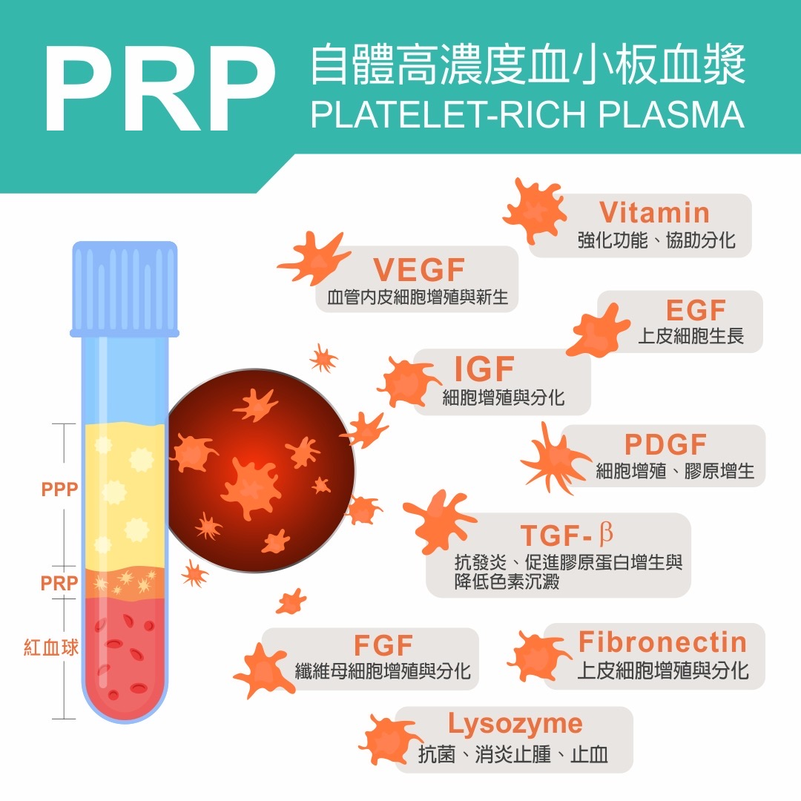
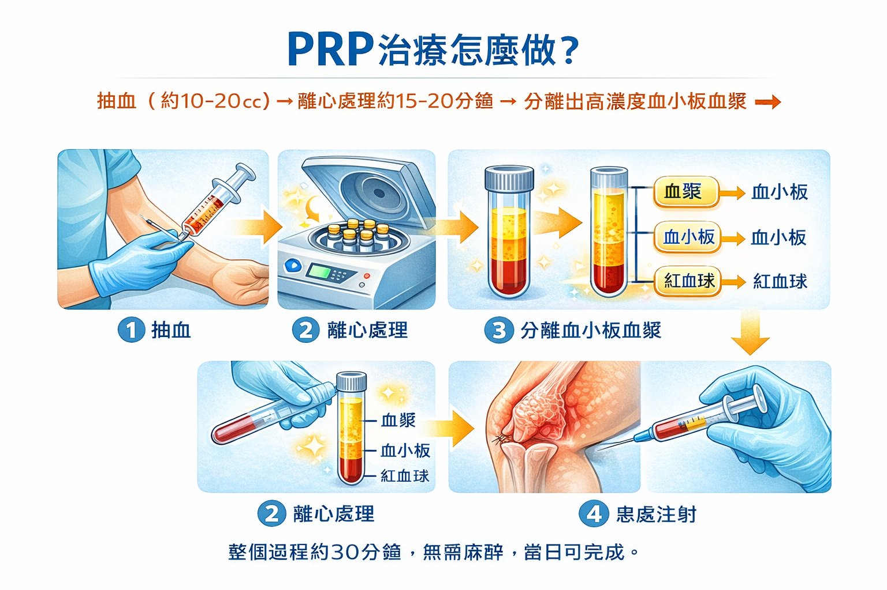
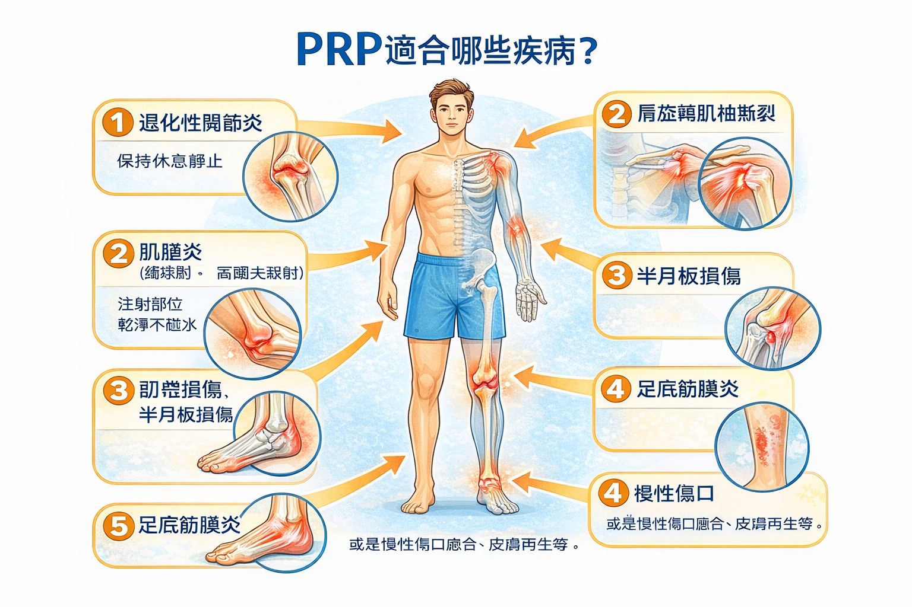

# PRP

Q1：什麼是 PRP？
A：PRP（Platelet-Rich Plasma，高濃度血小板血漿）是一種再生療法，利用抽取自體血液後分離出的富含血小板的血漿，注射回身體受損部位，透過血小板釋放的生長因子來促進組織修復、再生，並減緩發炎與疼痛，常用於治療運動傷害、退化性關節炎、肌腱、韌帶損傷等，因使用自身血液故無排斥風險。

Q2：PRP 有哪些生長因子？  (圖示)
A：「PRP裡的血小板會釋放9種生長因子，
像PDGF、TGF、VEGF等，幫助細胞再生與膠原合成。
Q3：PRP 治療怎麼做？  (一頁4格或流程圖圖示)
A：抽血（約10-20cc）→ 離心處理約15-20分鐘 → 分離出高濃度血小板血漿 → 患
處注射。

整個過程約30分鐘，無需麻醉，當日可完成。
Q4：PRP 適合哪些疾病？  (人體圖示)
A：退化性關節炎、肌腱炎（網球肘、高爾夫球肘）、韌帶損傷、半月板損傷、足底筋膜炎、肩旋轉肌袖撕裂等軟組織損傷，或是慢性傷口癒合、皮膚再生等。

Q5：PRP 治療注射後照護注意事項?  (圖示)
A：1.注射後24小時患部需多休息，避免過度使用。請不要激烈運動，盡量保持休息
靜止狀態。
2.注射後24小時請保持注射部位清潔乾燥。
3.注射後3天內會有脹痛感，可以冰敷於患處減輕痛感，每次約 10-15 分鐘，每
日 3-4 次。
4.注射後3天可正常活動，請於兩週後回診。
5.若注射部位紅腫發熱加劇、局部腫脹異常、發燒等症狀，應儘速就醫。
Q6：PRP 治療會痛嗎？
A：注射時可能會有短暫脹痛感，多數患者可耐受。
Q7：PRP 注射後多久會見效？
A：通常 2–6 週開始改善，完整效果約 3 個月。
Q8：PRP 有副作用嗎？
A：因使用自己的血液，風險低，但可能有暫時腫脹、痠痛。
Q9：PRP 需要禁食嗎？
A：不需禁食，但建議保持充足水分。
Q10：施打 PRP 前可以吃止痛藥嗎？
A：避免 NSAIDs（如布洛芬）以免降低療效，可用普拿疼類止痛。
Q11：PRP 做一次就有效嗎？
A：依病況而定，多為 1–3 次。
Q12：施打後可以運動嗎？
A：前 48 小時避免劇烈活動，之後依醫囑恢復訓練。
Q13：PRP 與玻尿酸有什麼不同？
A：玻尿酸偏向「潤滑」，PRP 偏向「修復」，兩者可互補。
Q14：PRP 使用自己的血液是否安全？
A：是的，PRP 取自個人血液，不會有排斥問題，感染風險也相對低。
Q15：PRP 與類固醇注射的差別是什麼？
A：類固醇消炎止痛快，但不能促進組織修復；PRP 則是啟動修復，效果較慢但較長久。
Q16：哪些人不適合做 PRP？
A：血液疾病、嚴重貧血、孕婦、癌症治療中、感染者不建議施作。
Q17：PRP 需要麻醉嗎？
A：一般不需要。
Q18：PRP 的療程間隔為多久？
A：一般建議 2–4 週施打一次。由醫師評估病症建議。
Q19：注射後的疼痛是正常的嗎？
A：是正常反應，可能持續 1–3 天，可冰敷減輕不適。
Q20：PRP 可以與復健同時進行嗎？
A：可以，但需依醫師指示，搭配復健治療項目。
Q21：施打 PRP 後可以泡溫泉或游泳嗎？
A：建議 48–72 小時內避免，降低感染風險。
Q22：PRP 對退化性關節炎有效嗎？
A：可改善疼痛與功能，尤其是中輕度退化者效果較佳。
Q23：PRP 的效果可以維持多久？
A：多數患者可維持 6–12 個月以上，依個人病況不同。
Q24：PRP 需要抽多少血？
A：通常抽取 10–20 c.c. 血液即可製作足量 PRP。
Q25：PRP 是立即見效嗎？
A：不是，因其原理是啟動修復過程，需要時間累積。
Q26：PRP 能治療急性運動傷害嗎？
A：可使用於韌帶撕裂、肌肉拉傷等急性損傷，但依傷勢由醫師評估。
Q27：PRP 注射後需要打石膏或護具嗎？
A：部分部位可能需要短期護具，視病況決定。
Q28：PRP 是否能用於五十肩？
A：可以。能減少發炎、降低疼痛並促進恢復，常與復健並用。
Q29：PRP 是否適用於腳踝或足底傷害？
A：是，足底筋膜炎、阿基里斯腱炎是常見適應症。
Q30：PRP注射後多久可以運動？
A：建議 1 週內避免劇烈運動，依個人情況調整。
Q31：為什麼 PRP 不是健保給付？
A：屬於再生醫學自費療程，目前不在健保常規治療項目內。
