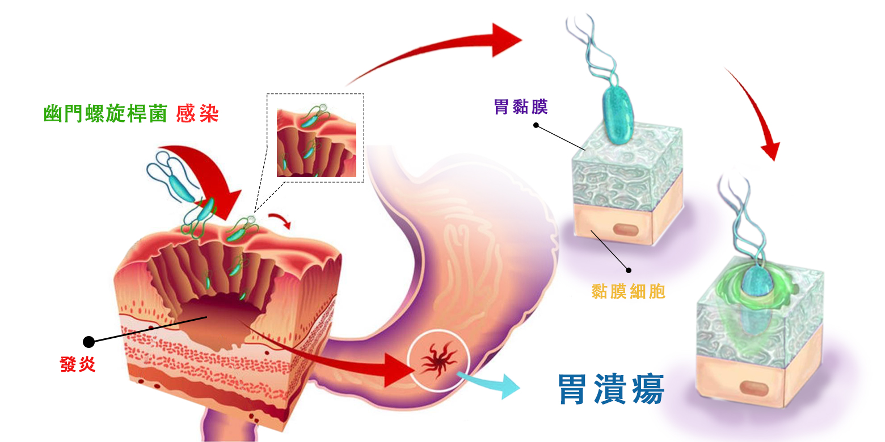
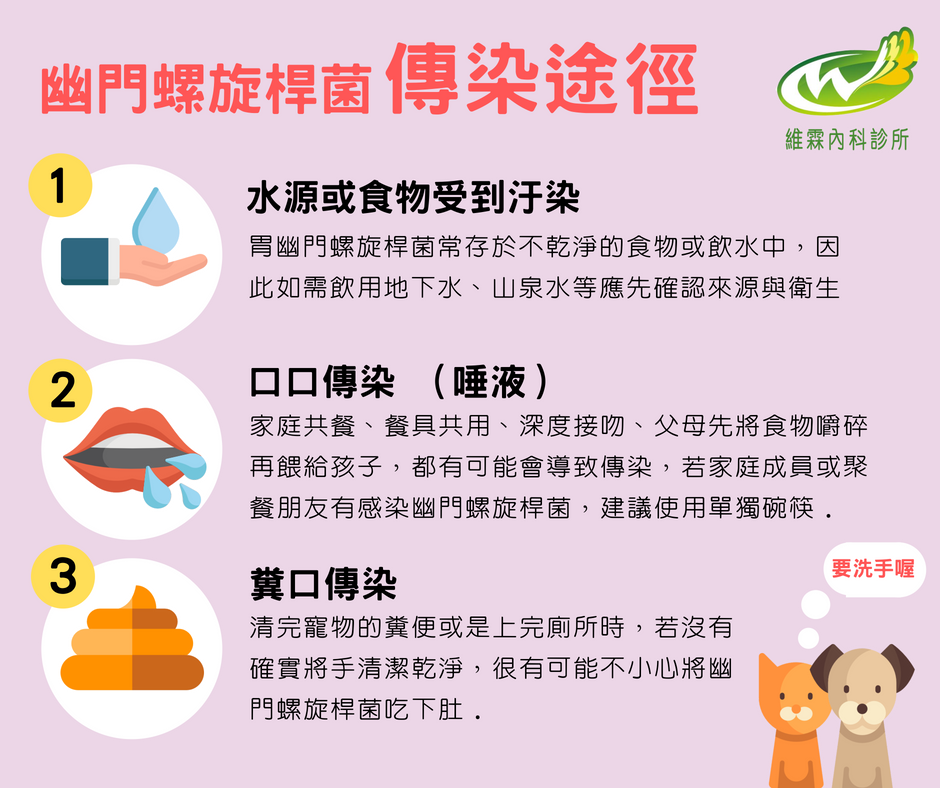
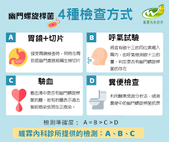
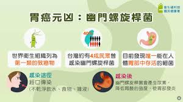
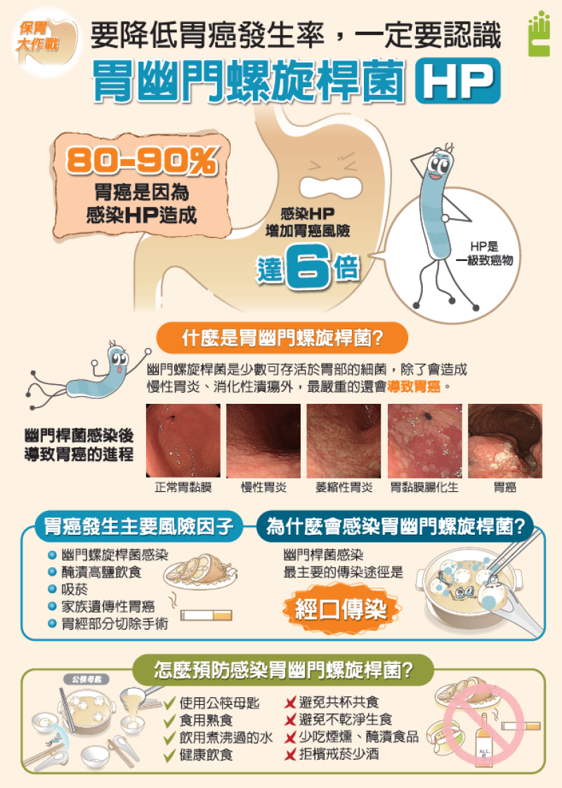

# 幽門螺旋桿菌

Q1：什麼是幽門螺旋桿菌？

A：幽門螺旋桿菌是一種寄生在胃黏膜的細菌，會
造成慢性胃黏膜發炎，是胃炎、胃潰瘍、十二指
腸潰瘍的常見原因，長期感染增加胃癌、胃黏膜
相關淋巴瘤風險。
Q2：幽門螺旋桿菌如何感染？

A：糞口途徑：帶菌者的糞便污染了水源或食物，他人誤食
後受感染。
口口途徑：透過唾液傳播，常見於家庭內的共食文化、
親吻，或長輩將食物咀嚼後餵食幼兒。
衛生習慣：飯前便後未落實洗手，或飲用未經煮沸的生水、食用未洗淨或未
煮熟的食物。
Q3：感染幽門螺旋桿菌的症狀有哪些？
A：- 上腹脹痛、悶痛
- 噁心、胃口不佳
- 消化不良、容易脹氣
- 但有些人沒有明顯症狀。
Q4：如何檢查是否感染幽門螺旋桿菌？

A：常用方法包括
- 碳13尿素呼氣試驗（最常見）
- 糞便幽門螺旋桿菌抗原
- 血清抗體檢查
- 胃鏡組織切片
治療後將安排呼氣測試或糞便抗原確認是否根除。
Q5：感染幽門螺旋桿菌一定要治療嗎？
A：1.治療目的：根除細菌、減少潰瘍、預防胃癌。
2.建議積極治療，尤其是胃炎、胃潰瘍患者或有家庭胃癌史者。
Q6：幽門螺旋桿菌會導致胃癌嗎？

A：世界衛生組織列為第一類的致癌物，是目前發現唯一一種能在胃部存活的細菌。會增加胃癌風險，因此早期治療可降低癌變發生率。
Q7：幽門螺旋桿菌如何治療？
A：1.常用治療方式：
- 兩種抗生素 + 一種抑制胃酸藥（PPI）
- 耐藥性高時使用四合一療法（PPI＋兩種抗生素＋鋇鹽類藥品）
2.療程約 10–14 天
Q8：治療期間可以喝酒嗎？
A：不可以，酒精會降低藥物效果並增加副作用。
Q9：治療幽門螺旋桿菌會有副作用嗎？
A：可能出現腹瀉、口中金屬味、腹痛等，多為短暫性。
Q10：治療完成後需要追蹤嗎？
A：需要，通常在治療後 4 週以上做碳13呼氣試驗確認是否根除。
Q11：幽門螺旋桿菌會自己好嗎？
A：不會，若不治療通常會持續感染並造成胃部慢性發炎，胃潰瘍、十二指腸潰
瘍，甚至癌病變。
Q12：小孩也會感染幽門螺旋桿菌嗎？
A：會，常為家庭內共餐傳染，或將食物咬碎餵食小孩。
Q13：幽門螺旋桿菌的抗藥性問題嚴重嗎？
A：部分抗生素已有抗藥性，因此醫師會評估選擇療程藥物。
Q14：幽門螺旋桿菌是否具傳染性？
A：具傳染性，但多在家庭密切接觸中傳播。
Q15：感染幽門螺旋桿菌會不會變瘦？
A：胃痛、脹氣、胃酸不適會影響食慾，因人而異，可能導致體重下降。
Q16：吃益生菌能治好幽門螺旋桿菌嗎？
A：不能根治，但益生菌可減輕治療期間副作用。
Q17：治療期間可以喝咖啡或茶嗎？
A：避免濃茶、咖啡和刺激性飲品，以免加重胃部不適。
Q18：幽門螺旋桿菌感染會造成口臭嗎？
A：可能會，因幽門螺旋桿菌引發胃部發炎導致口氣不佳。
Q19：夫妻需要一起治療嗎？
A：若另一半也感染，建議同時治療以降低再感染機會。
Q20：治療失敗怎麼辦？
A：需接受第二線或第三線療法，由醫師重新評估藥物組合。
Q21：若治療成功是否不會再感染？
A：仍有可能再感染，但機率不高，良好衛生習慣可降低風險。
Q22：哪些食物不建議大量攝取？
A：辛辣、油炸、咖啡、可樂、濃茶、酸性食物容易刺激胃部，建議減少攝取。
Q23：幽門螺旋桿菌是所有胃病的主因嗎？
A：不是，但它是胃炎、胃潰瘍和胃癌的重要危險因子。
Q24：治療期間胃不舒服怎麼辦？
A：可搭配胃藥緩解不適，若嚴重需與醫師聯繫調整藥物。
Q25：治療幽門螺旋桿菌要空腹吃藥嗎？
A：依藥物種類而定，多數治療藥物需飯後服用，請遵照醫師指示最安全。
Q26：可以透過使用公筷母匙預防感染嗎？
A：可以，大幅降低口口傳染機會。
Q27：幽門螺旋桿菌和壓力有關嗎？
A：壓力不會造成感染，但會加重胃部不適症狀。
Q28：什麼人最容易感染幽門螺旋桿菌？
A：家庭內共餐、衛生習慣不佳、飲用不潔水源者。
Q29：胃痛是不是代表感染幽門螺旋桿菌？
A：不一定，胃痛也可能來自胃食道逆流、消化不良等其他原因，需檢查確認。
Q30：幽門螺旋桿菌治療後多久會改善症狀？
A：多數人治療後 1–2 週胃部不適會減少，但完全恢復可能需要數週。

