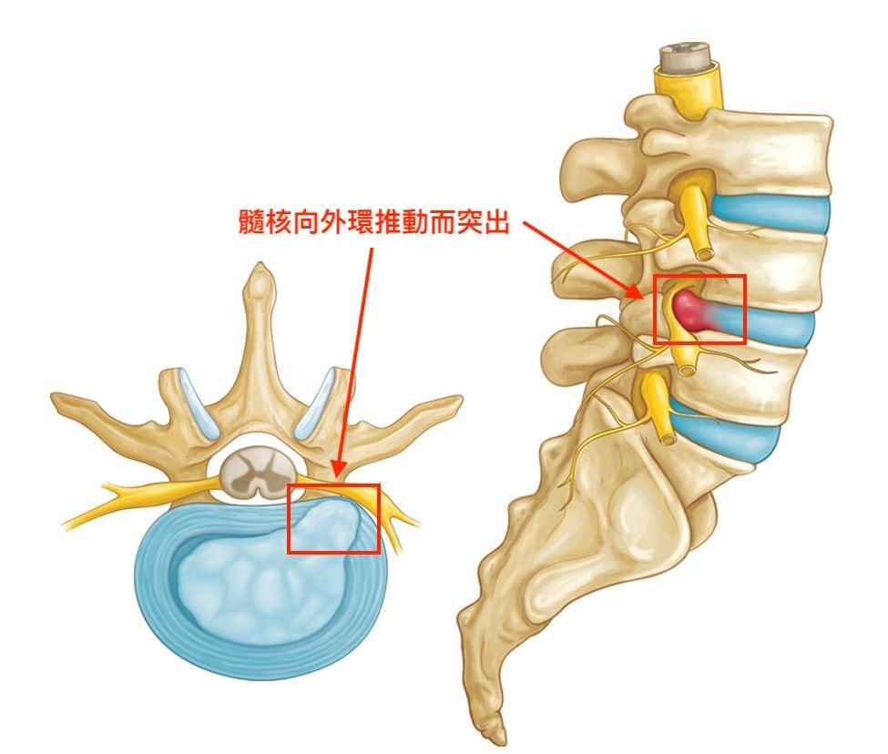
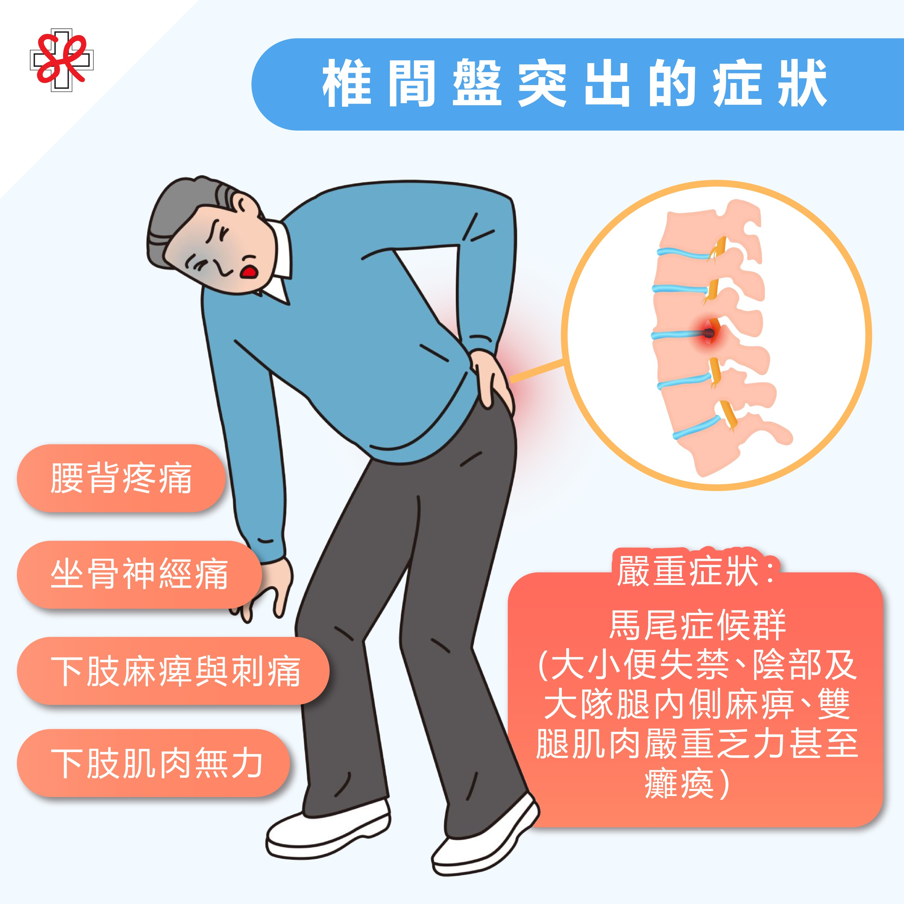
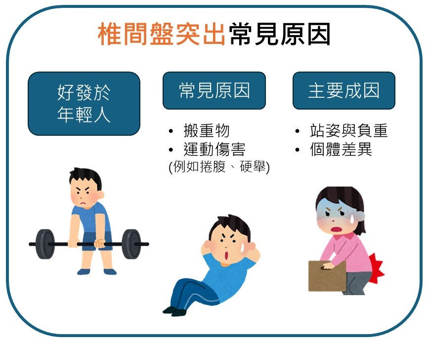

# 椎間盤突出

Q1：什麼是椎間盤突出？

A：椎間盤突出是下背疼痛、腿部疼痛或坐骨神經痛等疼痛的常見原因之一。椎間盤是位於脊椎骨之間的軟墊。椎間盤突出（Herniated Disc）是指脊椎骨間的椎間盤（緩衝墊）因老化、創傷或不良姿勢而破裂，內部髓核突出，壓迫鄰近神經，引起腰背或頸部疼痛、麻木、刺痛，甚至肢體無力，最常見於腰椎。
Q2：椎間盤突出的常見症狀有哪些？

下背/頸部疼痛：: 可能因咳嗽、噴嚏加劇。
坐骨神經痛：: 疼痛沿著腿部放射至腳底。
麻木、刺痛：: 患肢皮膚有異常感覺。
肌肉無力：: 行走可能跛行。
姿勢改變：: 骨盆傾斜。
嚴重症狀：: 大小便失禁、會陰麻木（馬尾症候群），需急診。
Q3：椎間盤為什麼會突出？

椎間盤突出的原因有:
退化：: 隨年齡增長，椎間盤含水量降低，彈性變差。
外力：: 摔倒、撞擊、運動傷害，或長期姿勢不良、搬重物。
壓力：: 肥胖導致腰椎壓力過大。
Q4：椎間盤突出常見的部位?
好發位置
腰椎：最常見，特別是第四、五腰椎與第一薦椎間(L4-L5, L5-S1)。
頸椎：第二常見，如頸5-6, 頸6-7。
Q5椎間盤突出和坐骨神經痛有什麼關係？
A：椎間盤突出物壓迫坐骨神經根就會產生坐骨神經痛。
Q6：椎間盤突出會自己好嗎？
A：多數患者經復健、藥物等保守治療能逐漸改善。若保守治療無效或症狀嚴重（如馬尾症候群）時則須考慮手術治療。
Q6：如何診斷椎間盤突出？
A：透過理學檢查、X光、MRI磁和共振檢查 判定神經壓迫程度。
Q7：椎間盤突出一定要開刀嗎？
A：不一定，約 80–90% 患者可透過復健、藥物等保守治療改善。
Q8：什麼情況需要手術？
A：無法忍受的疼痛、肌力明顯喪失、大小便失禁、症狀超過 6–12 週未改善。
Q9：常見的保守治療有哪些？
A：● 藥物治療:止痛藥、肌肉鬆弛劑
● 復健治療:牽引、熱敷
● 姿勢矯正
Q10：如何預防椎間盤突出？
保持良好姿勢，避免久坐。
適度運動，訓練強化核心肌群。
避免提重物，若需提重物注意正確搬重物姿勢。
維持健康體重。
Q11椎間盤突出的疼痛會擴散到哪裡？
A：常沿著神經路徑從腰部放射到臀部、大腿或小腿。
Q12：椎間盤突出與退化有關嗎？
A：有，年齡增加會讓椎間盤含水量下降較易破裂。
Q13：哪些動作容易加重椎間盤突出？
A：彎腰、扭腰、久坐、提重物、長時間開車。
Q14：椎間盤突出可以運動嗎？
A：可以，應選擇低衝擊運動，如走路、核心訓練。
Q15：游泳對椎間盤突出有幫助嗎？
A：有，水中浮力可減輕脊椎壓力。
Q16：椎間盤突出時應避免哪些運動？
A：跳躍、舉重、深蹲過重、扭腰運動。
Q17：復健可以減輕椎間盤突出情形嗎？
A：可增強核心肌群、改善姿勢、減輕神經壓迫。
Q18：熱敷還是冰敷比較好？
A：急性期以冰敷，慢性期以熱敷較佳。
Q19：椎間盤突出會造成腳麻嗎？
A：會，因神經受壓導致感覺異常或麻木。
Q20：椎間盤突出會造成無力嗎？
A：可能會出現肌力下降，嚴重時影響走路。
Q21：腰痛和椎間盤突出是同一件事嗎？
A：不是，腰痛原因很多，但椎間盤突出是其中一種。
Q22：什麼是椎間盤突出 5-1、4-5？
A：指椎間盤突出的脊椎節段，如:腰椎第4節-第五節L4–L5、腰椎第5節-薦椎第一節L5–S1，是最常突出的部位。
Q23：椎間盤突出會變成永久性損傷嗎？
A：若神經壓迫嚴重未治療，可能造成永久神經損害。
Q24：使用護腰有幫助嗎？
A：短期可減少疼痛，但不建議長期依賴。
Q25：坐姿會影響椎間盤突出嗎？
A：會，駝背與久坐會增加椎間盤壓力。
Q26：躺著會比較好嗎？
A：短期休息可減痛，但長期臥床會讓肌肉更弱，反而更痛。
Q27：椎間盤突出可以工作嗎？
A：大多可以，但需避免提或搬重物與長時間彎腰。
Q28：手術方式有哪些？
A：微創椎間盤切除、傳統開刀、內視鏡手術等。
Q29：手術後會復發嗎？
A：可能復發，尤其在不良姿勢或搬重物下。
Q30：椎間盤突出多久會好？
A：輕中度患者約 4–12 週可改善，視治療與生活習慣而定。
