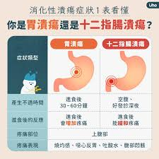
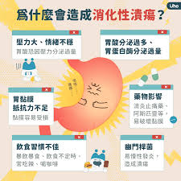
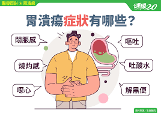
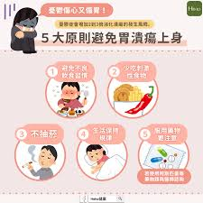

# 消化性潰瘍

Q1：什麼是消化性潰瘍？

A：消化性潰瘍是指消化道內壁黏膜組織發生潰爛，這多半是由於胃
酸過度侵蝕胃與十二指腸，或胃與十二指腸的防禦能力減弱所造
成的。
消化性潰瘍一般指的是胃潰瘍及十二指腸潰瘍
十二指腸潰瘍：好發於十二指腸的前端，靠近幽門處。常於飢餓時感到疼痛，進食後緩解。
胃潰瘍：好發於胃小彎靠近幽門處。常於進食後感到疼痛，約有4 %的機會轉成胃癌。
Q2：消化性潰瘍最常見的原因是什麼？

藥物：長期服用非類固醇抗炎症藥物
幽門螺旋桿菌感染
情緒壓力：情緒緊張、壓力過大
有家族遺傳傾向
飲食因素：喜愛吃刺激性食物者 ( 如：辣椒 )；暴飲暴食、進食不定時
過度抽菸、喝酒、咖啡過量
Q3：消化性潰瘍的症狀有哪些？

A：上腹疼痛與消化不良是最常見的症狀，部分患者會有心口
燒灼感、悶痛、脹痛、饑餓感、噁心、食慾不振、嘔吐、
吐酸水等症狀。
有時潰瘍會出血，使患者嘔出鮮血或黑色物體，並使糞便變為黑色或瀝青狀，潰瘍
進一步惡化時會導致胃壁穿孔，這時腹部會突然產生持續的劇痛。
Q4：如何診斷消化性潰瘍？
A：胃鏡檢查是最準確方式，讓醫師能直接觀察食道、胃及十二指腸，經由胃鏡檢查，胃的內
部可以清楚的顯示出來。
若有胃炎或潰瘍情形，醫師可以清楚知道潰瘍的大小、部位和程度。並視狀況做幽門螺旋
桿菌檢查或病理切片。
Q5：消化性潰瘍需要治療嗎?
治療潰瘍的主要目的是解除症狀，減低疼痛，使潰瘍痊癒，並預防潰瘍出血、胃壁穿孔或幽門阻塞等併發症發生。
Q6：消化性潰瘍要怎麼治療?
減低胃酸的分泌：藥物治療主要是減低胃酸的分泌，防止胃或腸壁繼續受侵蝕，從而幫助潰瘍的痊癒。
根除幽門螺旋桿菌：消化性潰瘍若是由幽門螺旋桿菌感染造成，復發率高，使用藥物治療後不可因症狀消失就停藥，否則容易復發，應確實完成整個療程，如此才能確保潰瘍被治癒。
確定診斷：由於胃潰瘍何胃癌不易分辨，所以有症狀時應接受專業醫師的檢查診斷，依症治療。
切勿亂服成藥，以免延誤治療。
Q7：如何日常保健預防消化性潰瘍？

A：
避免熬夜、生活規律。
避免壓力及情緒緊張。
避免抽菸、飲酒。
遵守醫師指示服藥，避免長期服用止痛藥或不明藥物。
定期追蹤檢查及治療。
Q8：胃潰瘍和十二指腸潰瘍有什麼不同？
A：胃潰瘍多為「吃完痛」；十二指腸潰瘍多為「空腹痛」且吃東西後緩解。
Q9：黑便代表什麼？
A：可能是上消化道出血，是潰瘍重要警訊，需要立即就醫。
Q10：消化性潰瘍會自己好嗎？
A：輕微潰瘍可能改善，但若未治療容易反覆發生或出血。
Q11：治療潰瘍的主要藥物有哪些？
A：制酸藥（PPI、H2 blocker）、保護黏膜藥物、抗生素（若為幽門桿菌感染）。
Q12：治療潰瘍需要多久？
A：通常需 4–8 週，依潰瘍大小與位置而定。
Q13：潰瘍需要禁食嗎？
A：一般不需完全禁食，但需避免刺激性食物。
Q14：消化性潰瘍會導致胃癌嗎？
A：胃潰瘍不等於癌症，但長期潰瘍需追蹤；若因幽門桿菌感染造成，治療後可降低胃癌風險。
Q15：喝咖啡會加重潰瘍嗎？
A：有可能，咖啡因會刺激胃酸分泌，建議減少或避免。
Q16：抽菸會影響潰瘍治療嗎？
A：會，抽菸會降低潰瘍癒合速度並增加復發。
Q17：壓力會造成潰瘍嗎？
A：壓力不直接造成潰瘍，但會加重症狀並影響胃酸分泌。
Q18：哪些食物會刺激潰瘍？
A：辣椒、油炸物、檸檬、咖啡、酒精、巧克力、碳酸飲料等。
Q19：胃藥可以長期服用嗎？
A：部分制酸藥可短期使用，是否長期需醫師評估。
Q20：潰瘍導致噁心是正常的嗎？
A：常見，特別在胃部收縮或進食後發生。
Q21：喝牛奶能治潰瘍嗎？
A：不能，牛奶短暫緩解，但可能刺激胃酸增加，反而加重不適。
Q22：不吃早餐會導致潰瘍嗎？
A：空腹久、胃酸分泌過多會刺激胃，可能增加潰瘍風險。
Q23：消化性潰瘍會出現什麼危險徵兆？
A：可能出現黑便、吐血、劇烈腹痛、突然冒冷汗、呼吸心跳加快、臉色蒼白…等危急狀況，
需立即就醫。
Q24：使用止痛藥會造成潰瘍嗎？
A：會，NSAIDs（如布洛芬、阿斯匹靈）會抑制胃黏膜保護層，導致潰瘍風險增加。
Q25：胃食道逆流和潰瘍一樣嗎？
A：不同疾病，但可能同時存在，並且症狀類似。
Q26：潰瘍治療後要不要再做胃鏡？
A：若為胃潰瘍或症狀未改善，通常建議追蹤胃鏡。
Q27：幽門螺旋桿菌治療成功後潰瘍會好嗎？
A：大部分人會改善，且可降低再發率。
Q28：消化性潰瘍會影響睡眠嗎？
A：會，特別是夜間胃痛或空腹痛會讓人醒來。
Q29：潰瘍會造成貧血嗎？
A：會，若長期慢性出血會導致慢性貧血。若潰瘍情況嚴重，亦有可能因急性出血，吐血
情形，造成急性貧血。
Q30：消化性潰瘍飲食要注意什麼?
A：
吃飯要定時適量，細嚼慢嚥，心情放鬆，飯後要略作休息再開始工作。
多攝取含豐富維生素C及鐵質的食物。
產氣性食物及甜食會使病人有飽脹感而不舒服，應盡量少吃。
食物烹煮的方法應以蒸、煮、燉或製成糊泥狀較易消化，避免煎烤油炸。
食用清淡少油、無刺激性、易消化飲食。避免食用高纖維蔬菜，如：蔬菜的梗部、莖部和老葉及及酸度高的及含皮、子、纖維多的水果，如：鳳梨、蕃石榴等及核果類。
避免辣椒、芥茉等刺激性調味料及刺激性飲料，如：濃茶、咖啡、酒等。
