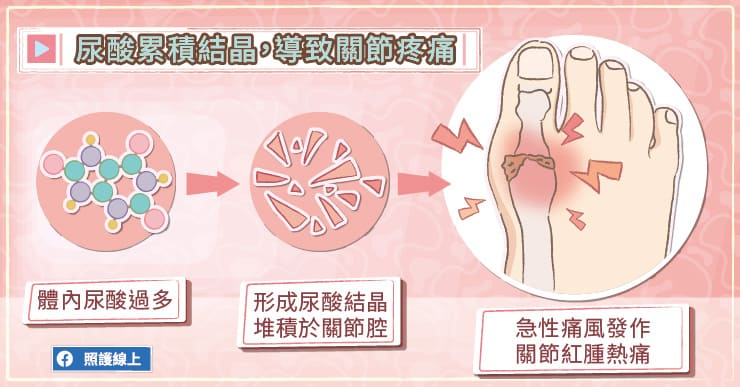
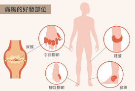
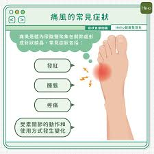

# 痛風

Q1：什麼是痛風？

A：痛風(GOUT)是一種體內普林(purine)代謝異常的疾病，導致尿酸濃度升高。當體內產生太多的尿酸，或是腎臟排出尿酸的功能障礙，不能有效將尿酸排出體外時，多餘的尿酸就會結晶沉積在關節（俗稱痛風石）軟骨、. 滑液囊、肌腱或軟組織，造成紅腫. 熱痛急性發炎反應，導致病患劇烈疼痛或行走不易。
Q2：痛風最常痛在哪裡？

A：最常見於大腳趾關節，其次是踝關節、膝蓋、手腕等。
Q3：痛風發作的典型症狀是什麼？
A：關節突然劇痛、紅腫、灼熱、觸碰即痛，

多在夜間或清晨發作。
Q4：痛風發作多久會好？
A：發作時通常會持續一兩週，然後消退，但若未治療容易反覆發作。
Q5：為什麼會痛風？
A：造成痛風的主因，尿酸生成過多或代謝減少
(1) 尿酸生成過多：常見飲食不當過量攝取普林、或是腫瘤溶解症候群、溶血性貧血以及化療的併發症等。
(2) 尿酸代謝減少：例如先天尿酸代謝機能異常、慢性腎臟炎、糖尿病酮酸中毒及酒精中毒等。
Q6：如何檢查是否痛風？
A：抽血測尿酸、關節液檢查（確認尿酸結晶）、X光或超音波。
Q7：尿酸高就一定會痛風發作嗎？
A：不一定，但尿酸越高發作風險越大。
Q8：痛風發作時應該冰敷還是熱敷？
A：急性發作時建議冰敷，減少發炎。
Q9：痛風會遺傳嗎？
A：有遺傳傾向，家族中有痛風者風險較高。
Q10：痛風與腎臟有什麼關係？
A：尿酸由腎臟排出，腎功能差會使尿酸累積；反覆痛風也可能造成腎結石或腎損傷。
Q11：痛風發作時可以走路嗎？
A：若疼痛可承受則可活動，但應避免劇烈使用患部。
Q12：痛風發作時能喝咖啡嗎？
A：黑咖啡適量可降低痛風風險，但發作期間仍需避免含糖咖啡。
Q13：喝啤酒會引起痛風嗎？
A：會，啤酒含大量普林且促進尿酸生成，是痛風重要誘因，要減少啤酒飲用。
Q14：哪些食物普林含量高？
A：內臟、甲殼類海鮮、小魚干、肉汁、火鍋湯底、啤酒、含酵母類食物如:養樂多、發酵乳等，都是普林含量很高的食物。
Q15：低普林飲食可以治好痛風嗎？
A：能降低發作，但無法完全治癒，仍需藥物控制尿酸。
Q16：痛風藥要吃一輩子嗎？
A：痛風是一種慢性疾病，目前沒有可以完全跟治的方法。但通過適當的治療和管理，可以控制痛風的症狀和預防復發。藥物服用依個人狀況由醫師評估建議。
Q17：痛風了，是不是一定要吃藥？
A：食藥署先帶您了解三種常見的痛風類型及如何治療與預防：
1.無症狀高尿酸血症：當血液中驗出尿酸過高，但是沒有明顯症狀時，通常不需用藥治療，但須找到發生的原因，並予以控制。
2.急性痛風：治療方式以用藥為主，常用藥品包括秋水仙素、類固醇或非類固醇消炎止痛藥等。這些藥品的效果快速，通常在服藥後症狀會立即緩解。
3.慢性痛風：除了按時服用抑制尿酸合成劑（如Allopurinol及Febuxostat）、增加尿酸排除劑（如Benzbromarone、Sulfinpyrazone及Probenecid）、尿酸分解劑（如Pegloticase）等方法外等方法外，也可從飲食方面著手，避開高普林食物，多吃蔬菜水果以鹼化體質，少吃甜食或炸物，每日足量的飲水，對於慢性痛風的預防都有幫助。
Q18：痛風會造成關節變形嗎？
A：會，長期未控制會生成痛風石並破壞關節。
Q19：為什麼夜間容易痛風發作？
A：夜間體溫較低、攝取水份較少血液濃度變化，讓尿酸更容易形成結晶。
Q20：痛風發作時要多喝水嗎？
A：需要，每天至少 2000–3000 c.c. 促進尿酸排出。
Q21：哪些藥物可能引發痛風？
A：利尿劑、阿斯匹靈、部分降壓藥會提高尿酸。
Q22：體重過重會增加痛風風險嗎？
A：會，肥胖會增加尿酸生成並降低排出。
Q23：痛風患者可以運動嗎？
A：急性期避免運動，平時鼓勵規律運動有助減少發作。
Q24：痛風與代謝症候群有關嗎？
A：有密切相關，痛風常伴隨高血壓、糖尿病、高血脂。
Q25：喝水能降低尿酸嗎？
A：能促進尿酸排出，但無法完全取代藥物治療。
Q26：無糖飲料可以喝嗎？
A：可以，但避免含果糖的飲料，果糖會提高尿酸。
Q27：痛風石是什麼？
A：尿酸結晶長期沉積形成的硬塊，可出現在關節、耳朵、皮下。
Q28：痛風石可以消失嗎？
A：尿酸長期控制良好時，痛風石可縮小或減少。
Q29：痛風多久要回診一次？
A：急性期應密切追蹤；控制穩定後可每 3–6 個月追蹤尿酸。
Q30：如何預防痛風？
A：預防痛風，從飲食做起
人體約有20 %的普林是由飲食獲得，高普林食物容易導致體內尿酸濃度上升造成尿酸結晶，因此，「控制普林攝取」對於曾有痛風發作的患者而言尤其重要：
(1) 控制肉類攝取：少吃紅肉（牛、羊、豬肉），可以用魚肉、豆類、蛋、乳製品來取代，吃火鍋時儘量不要喝湯底。
(2) 降低高普林食物攝取：如甲殼類海鮮（蚌蛤、蛤蜊、干貝、蝦、蟹)、菇類（香菇、草菇、洋菇)、豆類（黃豆、黃豆芽)、酵母粉、小魚乾。
(3) 降低酒精攝取：部分酒類本身就含有很高濃度的普林，如紹興酒和啤酒。且酒精會影響尿酸代謝，酒精濃度愈高，對腎臟健康影響也愈大，故平時不常喝酒的人若短時間攝取大量酒精，也可能誘發急性痛風發作。
(4) 降低脂肪攝取：攝取過多脂肪會抑制尿酸代謝，增加痛風發作的風險。動物性脂肪（尤其是肥肉）和油炸類食物要降低攝取。
(5) 每日充足飲水：每日飲水量務必維持在2000 C.C.以上，幫助身體排泄尿酸，同時預防腎結石。
想要遠離痛風，充足的睡眠、良好的飲食習慣、適當的運動、維持標準體重，都是讓您維持健康的不二法門。
https://www.fda.gov.tw/upload/e_images/933%E6%8F%92%E5%9C%96-03.png
