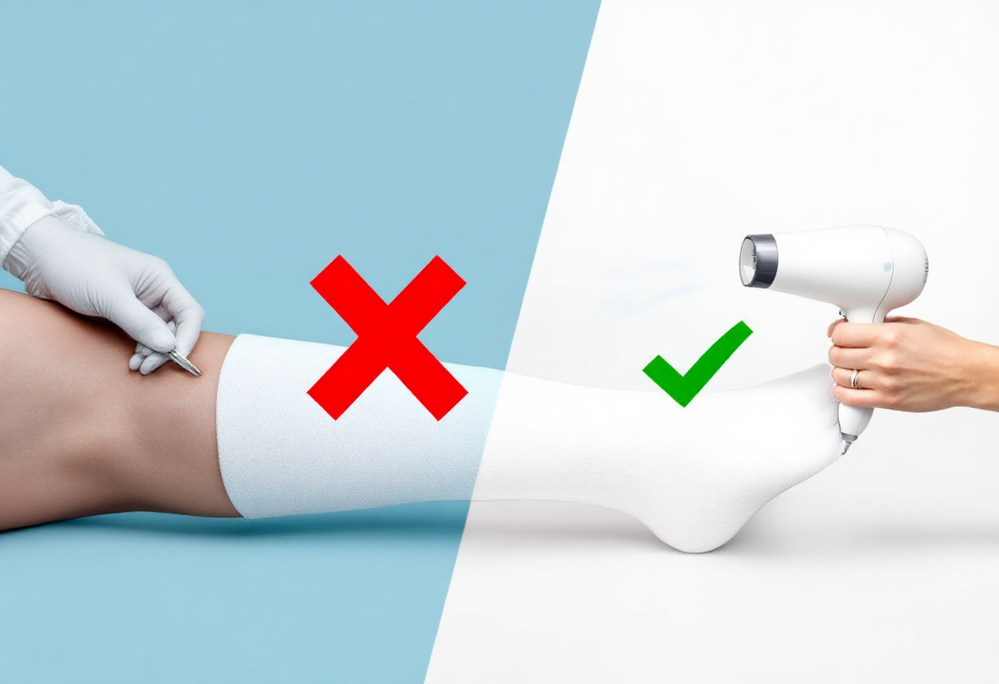

# 石膏固定後照護

打石膏後注意事項(石膏照護)
Q1：石膏弄濕怎麼辦？
A：若石膏潮濕會造成石膏變形，影響支撐固定，並且容易因石膏變形造成皮膚壓力不均產生壓瘡，或潮濕悶住皮膚而導致皮膚破損，需盡快回診更換。
Q2：石膏裡皮膚很癢怎麼辦？
A：打石膏後因皮膚乾燥、汗液刺激、過敏反應或神經修復可能會造成皮膚癢。
當石膏內的皮膚感到搔癢難耐時，正確的處理方式至關重要，以避免不必要的傷害和併發症。
正確做法：安全止癢
使用吹風機的冷風朝石膏開口內部吹拂。
輕柔地拍打石膏外側，分散注意力。
錯誤做法：插入尖銳物
絕對不能用筷子、抓癢器、尺子或其他任何尖銳物品伸進石膏內部搔抓。這種行為極易導致：
皮膚刮傷或感染

壓瘡形成
石膏結構受損
若搔癢持續，最好的方式是回診向醫師諮詢，我們可以根據具體情況給予建議，甚至開立適合的藥物。
保持石膏乾燥、清潔，活動外露的指趾，並抬高患肢，可幫助減輕不適並促進復原。千萬不可在石膏裡塞東西！容易刮傷皮膚導致感染。
Q3：石膏變得很緊怎麼辦？
A：可能是肢體腫脹造成，若伴隨麻木、蒼白、嚴重疼痛需立即回診。
Q4：下肢石膏固定期間能走路嗎？
A：依部位及骨折受傷情形而定，下肢骨折受傷石膏固定後，一般需使用柺杖或助行器輔助行走，初期通常患肢需離地不負重。負重行走須遵循醫師交代，以免造成骨折移位不癒合。
Q5：石膏內有異味怎麼辦？
A：輕微正常，但若惡臭或滲液需評估是否感染。
Q6：石膏期間可以洗澡嗎？
A：可以，但需完全防水，可用塑膠袋包覆。
Q7：石膏邊緣刮皮膚怎麼辦？
A：可用醫療膠布保護邊緣，但勿自行拆除。
Q8：打石膏後感覺手指(腳趾)腫脹要緊嗎？
A：若腫脹輕微可輕輕活動末梢關節、按摩或抬高肢體促進血液循環，消腫脹。若腫到動不了或肢體末梢顏色改變，呈現紫黑色需盡快回診，由醫師評估處置。
Q9：石膏期間可以開車嗎？
A：多數情況不行，會影響反應與安全性。
Q10：拆石膏會痛嗎？
A：不會，拆除工具不會割傷皮膚。
Q11：石膏下的皮膚會長疹子怎麼辦？
A：若輕微可保持乾燥觀察，若紅腫、流膿或癢得厲害，需立即回診評估是否有感染或過敏。
Q12：可以在石膏上畫畫或貼貼紙嗎？
A：一般不影響，但避免使用會滲透的墨水或液體，避免潮濕與刺激皮膚。
Q13：戴石膏期間一直想動關節正常嗎？
A：是正常的，因固定期間活動受限，但不要強行動作，以免移位。
Q14：石膏內感覺燙燙的需要緊張嗎？
A：可能是腫脹或發炎，若持續或伴隨劇痛、麻木需回診。
Q15：拆石膏後為何皮膚脫皮或長白屑？
A：長期覆蓋造成角質堆積，屬正常，保濕即可改善。
Q16：拆石膏後手或腳為何變小或無力？
A：長期不用造成肌肉萎縮，可透過復健恢復。
Q17：石膏硬化需要多久？
A：一般傳統石膏需 24–48 小時完全硬化，玻璃纖維則快得多。
Q18：剛打石膏可不可以馬上走？
A：依醫師指示，有些石膏需完全乾燥後才能負重。
Q19：石膏內會發熱是正常反應嗎？
A：剛製作時化學反應會產熱，是正常現象，但不會燙傷。
Q20：石膏期間可以做上班族的桌面工作嗎？
A：大多可以，除非石膏位置影響操作或醫師另有規定
Q21：為什麼石膏後要抬高患肢？
A：抬高可減輕腫脹，降低壓迫感，避免循環問題。
Q22：如何判斷石膏太鬆？
A：若能輕易移動、感覺支撐不足或骨折處疼痛加劇，可能需重做。
Q23：石膏破掉一小塊怎麼辦？
A：小破裂可能影響支撐，需回診請醫師評估，視需要補強或重打。
Q24：石膏邊緣刺痛怎麼改善？
A：可用醫療膠布或軟墊包覆邊緣，但勿自行切除石膏。
Q25：若石膏下有異物掉進去怎麼辦？
A：禁止自行伸手取出，可能造成皮膚損傷，應回診由專業人員處理。
Q26：打石膏期間可以搭乘飛機嗎？
A：一般可以。部分航空公司會要求石膏打滿 24–48 小時後才能搭乘，避免腫脹壓迫。
Q27：石膏期間可以洗頭嗎？
A：可以，但需避免石膏濕掉，可使用防水套。
Q28：玻璃纖維石膏跟傳統石膏怎麼選擇？
A：玻璃纖維較輕、不易吸水、硬化快，也較通風，患者感覺會較為舒適，但健保不給付，需自費。
Q29：拆石膏後需要復健嗎？
A：多數需要，因固定期間關節與肌肉缺乏運動、使用，可能導致關節僵硬、肌肉萎縮，而影響活動度。經由復健期能改善關節活動受限，恢復肌力。
Q30：石膏固定通常需要多少時間？
A：依骨折、韌帶損傷部位或受傷狀況不同而異，一般 4–8 週；骨折嚴重者可能更久。
