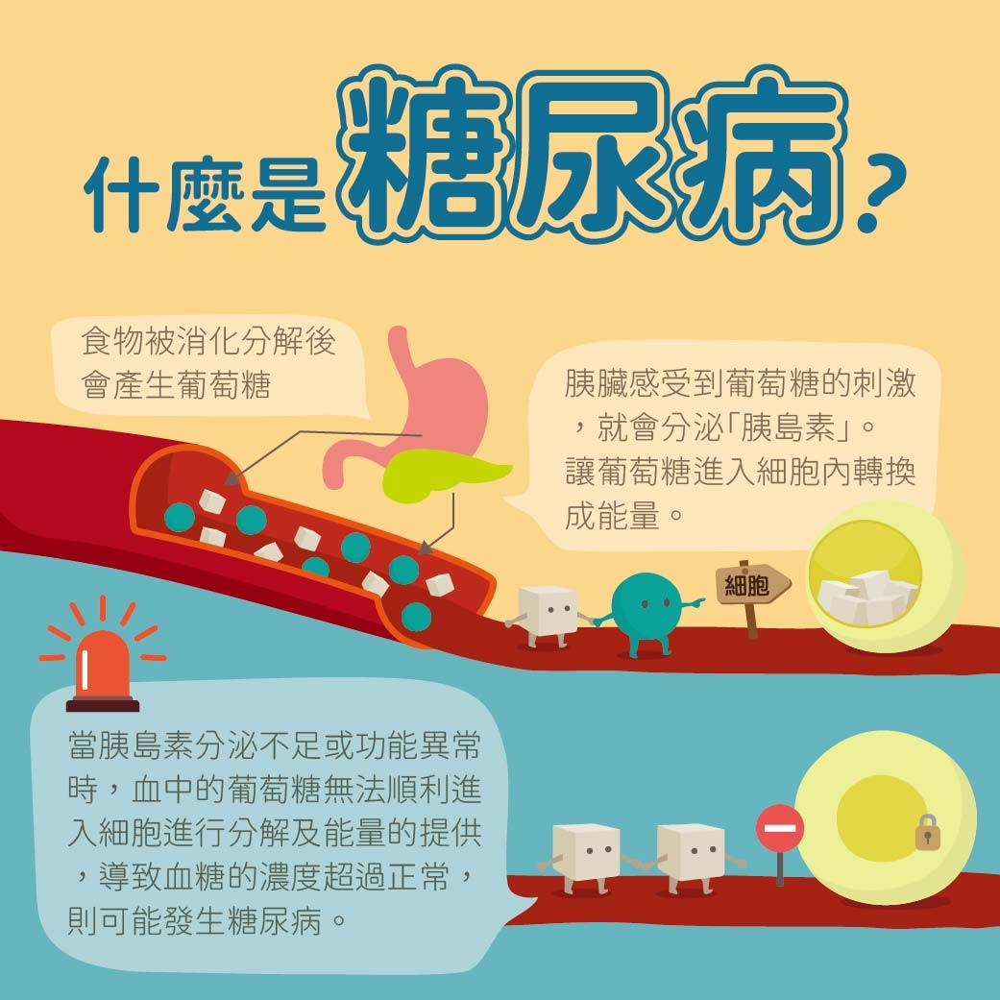
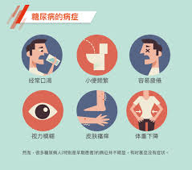
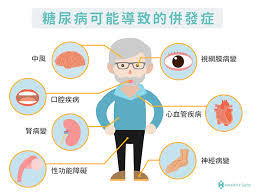

# 糖尿病

Q1：什麼是糖尿病？

A：糖尿病是一種慢性代謝異常疾病，主要因胰島素分泌不足或作用不良，導致血糖無法有效控制，所以造成血糖過高。當血糖超過腎臟的負荷時，血液中的糖分便會經由尿液排出，故稱為糖尿病。體內血糖過高，長期可能導致多重健康問題。
Q2：糖尿病有哪幾種類型？
A：主要分為第一型糖尿病、第二型糖尿病、妊娠糖尿病及其他特殊型態。
Q3：糖尿病的常見症狀是什麼？

A：多尿、口渴、多喝、易餓多吃、體重下降、疲倦、
視力模糊。
Q4：糖尿病如何診斷？
A：抽血檢查空腹血糖、飯後血糖、糖化血色素（HbA1c）即可診斷。
Q5：糖化血色素（HbA1c）是什麼？
A：反映過去 2–3 個月平均血糖，是判斷糖尿病控制的重要指標。
Q6：糖尿病會遺傳嗎？
A：會，家族中有患者則風險較高。
Q7：糖尿病患者一定要吃藥嗎？
A：依嚴重程度而定，有些人可先透過飲食與運動改善，血糖高者需用藥或胰島素治療。
Q8：糖尿病一定會打胰島素嗎？
A：不一定，多數第二型糖尿病先以口服藥治療。
Q9：沒症狀也可能有糖尿病嗎？
A：可能，很多人無明顯症狀，但血糖已異常。
Q10：糖尿病會引起哪些併發症？

A：腎病變、視網膜病變、神經病變、心血管疾病、中風、截肢等…風險增高。
Q11：糖尿病患者餐後血糖多久會升高？
A：通常在進食後 30–90 分鐘達到高峰。
Q12：糖尿病患者可以吃水果嗎？
A：可以，但需控制份量、選低 GI 水果，避免果汁。
Q13：白飯和麵哪個比較容易升血糖？
A：兩者都會升糖，但細緻澱粉如白飯、白麵條 GI 較高。
Q14：運動對糖尿病有什麼好處？
A：可提高胰島素敏感度、降低血糖、減少心血管風險。
Q15：糖尿病患者應該運動多久？
A：每週至少 150 分鐘中等強度運動，例如快走。
Q16：糖尿病患者可以喝無糖手搖飲嗎？
A：可以，但需注意不加奶精（含反式脂肪），避免含糖配料。
Q17：糖尿病患者為什麼容易傷口不癒合？
A：因血液循環差、神經受損及免疫力下降。
Q18：低血糖的症狀有哪些？
A：冒冷汗、手抖、心悸、頭暈、饑餓、意識模糊甚至昏迷。
Q19：遇到低血糖應怎麼做？
A：立即補充 15g 含糖食物，或飲料 120 c.c.，5–10 分鐘後再測血糖。
Q20：糖尿病患者需要定期檢查什麼？
A：眼底、腎功能、足部檢查、血脂、血壓。
Q21：糖尿病能治癒嗎？
A：第一型需要終身治療；第二型無法根治，但可透過控制讓血糖較平穩趨近正常。
Q22：為什麼肥胖容易導致糖尿病？
A：脂肪堆積會降低胰島素敏感度，使血糖控制變差。
Q23：糖尿病患者可以喝酒嗎？
A：不建議，酒精會影響血糖，有低血糖與高血糖的雙重風險。
Q24：代糖飲料可以喝嗎？
A：適量可以，但不宜過量，以免增加食慾與代謝負擔。
Q25：糖尿病患者常用哪些藥物？
A：糖尿病的藥物治療日新月異，遵從醫師指示按時服藥、定期追蹤血 糖控制狀況及藥品相關副作用、定期檢查是否出現糖尿病相關併發 症是非常重要的。另外還需搭配規律運動、不菸不酒、維持良好飲 食習慣、體重控制，才能夠達成最好的治療效果。
糖尿病藥物主要可依據作用機轉與其結構分成五大類：
一、 改善胰島素敏感性 1. 雙胍類（biguanides）2. 胰島素敏感劑
二、促進胰島素分泌 1. 硫醯基尿素類 2. 美格替耐（meglitinide）類  3. 胰島素（insulin）
三、延緩糖分吸收：α－葡萄糖甘酶抑制劑
四、促進糖分排除：鈉-葡萄糖共同轉運器 2 抑制劑
五、增加腸泌素作用 1. 雙基胜肽酶-4 抑制劑 2. 升糖素類似胜肽 1 受體活化劑
Q26：GLP-1 注射對糖尿病有什麼好處？
A：降低食慾、減重、穩定血糖並保護心血管。
GLP-1藉由刺激胰臟分泌胰島素以及抑制其分泌昇糖素，同時也會延遲胃排空降低食慾。也因如此，GLP-1促效劑除了幫助病人控制血糖還可以降低體重。
Q27：糖尿病患者是否需要控制血壓與血脂？
A：需要，糖尿病合併高血壓或高血脂會大幅增加心血管風險。
Q28：糖尿病患者可以正常飲食嗎？
A：可以，只要均衡飲食、注意以下原則:
1.減少碳水化合物攝取：碳水化合物通常存在於含澱粉的主食或含糖的食物和食材中，如白飯、麵類、根莖類，以及大多數水果與麵包、甜點、飲料。要適量攝取，不宜過多。
2.蛋白質早餐穩定血糖：早餐蛋白質攝取較多的，餐後血糖最高值比蛋白質攝取少的低。
3.增加纖維質攝取：可藉由高纖維飲食方式，來控制血糖，並減少低血糖的情況發生。富含纖維的食物，例如蔬菜、水果、豆類和全穀類食物等。
Q29何預防糖尿病？
A：第一型糖尿病與自身遺傳體質關係密切；第二型糖尿病有明確的預防方法，包括均衡飲食、維持適當體重及培養運動習慣，同時也應戒菸、避免吸入二手菸和過度飲酒，以減低將來患上糖尿病的機會。
Q30：糖尿病的併發症有哪些?
A：病若長期控制不佳，可能引發一系列嚴重的併發症，包括急性併發症與慢性併發症。
急性併發症包括糖尿病酮酸中毒，與高血糖高滲透壓非酮酸昏迷（HHNK），這兩種狀態若未及時處理，可能危及生命，需要緊急就醫。
而慢性併發症則因長期血糖控制不良逐漸發展而成，主要有以下幾種：
心血管疾病：高血糖會導致動脈硬化，增加心臟病、中風與高血壓的風險。
糖尿病腎病變：血糖持續偏高可能會損傷腎臟微血管，嚴重時甚至導致腎衰竭，需要透析治療（洗腎）或腎臟移植。
視網膜病變：長期高血糖會破壞眼部微血管，可能引起視力模糊、白內障、青光眼，甚至失明。
神經病變：血糖過高可能損傷神經系統，導致四肢麻木、刺痛或感覺喪失，嚴重時甚至引起截肢。
足部潰瘍與感染：糖尿病患者因神經與血管病變，導致腳部感覺減退、傷口難以癒合，容易發生感染與潰瘍，嚴重時可能需要截肢。
