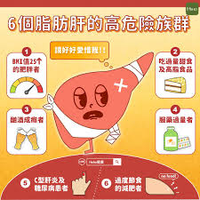
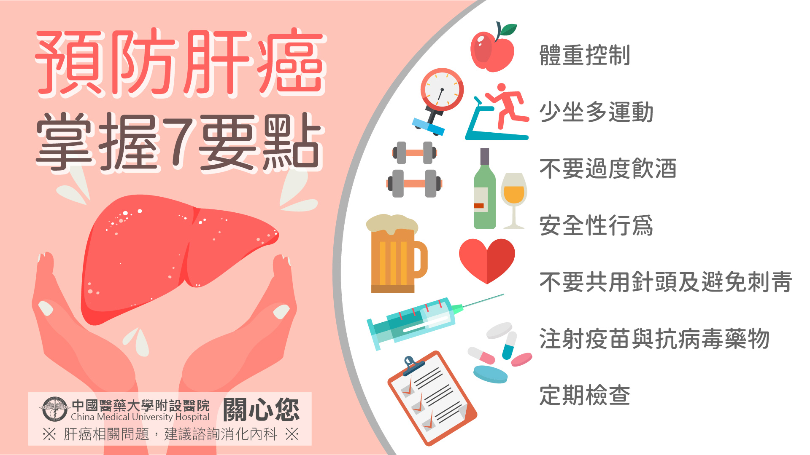

# 脂肪肝

Q1：什麼是脂肪肝？
A：其實就是我們俗稱的「肝包油」，實際上就是肝細胞聚積了許多脂肪，當進入肝臟代謝的脂肪多過人體所能應付時，肝臟便會漸漸蓄積這些脂肪。如果肝臟內的脂肪量超過肝臟總重5%以上，便稱為脂肪肝。
Q2：脂肪肝最常見的原因是什麼？
A：
肥胖: 體重過重為最常見的原因。

三高與代謝問題：包括高血脂（特別是三酸甘油酯過高）、糖尿病等
飲食與生活習慣：長期攝取高糖飲食（如含糖飲料、精緻澱粉）、高油脂食物，以及缺乏運動導致熱量過剩。
過量飲酒：長期酗酒會導致酒精性脂肪肝。
病毒性肝炎:如C型肝炎帶原者
其他因素：包含特定藥物副作用（如類固醇）、遺傳、快速減重或營養不良等。
Q3：脂肪肝有哪幾種類型？
A：分為酒精性脂肪肝與非酒精性脂肪肝（NAFLD）。
Q4：脂肪肝會有症狀嗎？
A：一般而言脂肪肝的病程是相當溫和的，大多數人並不會有明顯症狀，少部分人會覺得倦怠、食慾不振、噁心或吃完飯後上腹有飽漲感，有時也有肝功能不正常的現象。
Q5：脂肪肝怎麼檢查？
A：脂肪肝最方便的診斷方法是腹部超音波檢查，必要時最確實的方法是病理切片檢查。
Q6：如何預防脂肪肝？

A：改變生活習慣：一般脂肪肝常見的原因都和現代的
生活型態有關，所以脂肪肝可以說是營養過剩的文
明病，戒酒、減重、飲食少油少糖、避免含糖
飲料，控制血脂、糖尿病等，並且規律運動，是最佳改善脂肪肝的方法。
Q7：脂肪肝嚴重嗎？
A：若未改善，可能進展為肝炎、肝纖維化、肝硬化甚至肝癌。
Q8：脂肪肝可以治好嗎？
A：可以，透過減重、飲食調整、運動、戒酒等即可改善。
Q9：如何改善非酒精性脂肪肝？
A：減重 5–10%、均衡飲食、控制血糖血脂、維持規律運動。
Q10：喝酒會造成脂肪肝嗎？
A：會，過量飲酒會造成酒精性脂肪肝。
Q11：脂肪肝會影響肝功能嗎？
A：可能會。脂肪肝可能造成肝細胞受損或發炎，使肝功能指數GOT、GPT上升。
Q12：脂肪肝需要治療嗎？
A：事實上脂肪肝本身並沒有特殊的藥物可以治療，治療的方法主要還是靠去除病因，例如確實戒酒、減重、少吃油膩食物、控制血脂肪、糖尿病等，並且多運動，以生活型態改善為主，只要持之以恆，脂肪肝自然就會消失。
若有高血脂症或糖尿病，醫師會針對伴隨疾病開立降血脂、降血糖藥物作為治療。
Q13：脂肪肝檢查需要禁食嗎？
A：腹部超音波檢查需禁食6-8小時。
Q14：脂肪肝患者適合哪些食物？
A：高纖蔬菜、全穀物、深海魚、適量水果、橄欖油。
Q15：脂肪肝禁忌食物有哪些？
A：油炸物、手搖飲、甜品、加工食品、含糖飲料、肥肉。
Q16：體重減輕多少會改善脂肪肝？
A：減少體重的 5–10% 可明顯改善脂肪堆積。
Q17：運動可以改善脂肪肝嗎？
A：可以，建議每週至少 150 分鐘中等強度運動（如快走）。
Q18：脂肪肝跟三酸甘油脂高有關嗎？
A：非常相關，高油脂與高糖飲食會使脂肪堆積在肝臟。
Q19：脂肪肝的「肝指數」正常就沒事嗎？
A：不一定，肝指數正常仍可能有脂肪肝，需做腹部超音波檢查確認。
Q20：脂肪肝會造成右上腹不適嗎？
A：可能會，肝臟包膜受牽動會感到悶痛。
Q21：脂肪肝會造成疲倦嗎？
A：會，肝臟代謝負擔增加，可能使人容易疲累。
Q22：脂肪肝會變成肝硬化嗎？
A：若脂肪肝持續發炎（NASH），可能進展到肝硬化。
Q23：脂肪肝會傳染嗎？
A：不會，脂肪肝是一種代謝疾病，與感染無關。
Q24：脂肪肝與糖尿病關係密切嗎？
A：非常密切，脂肪肝患者約 70% 有胰島素阻抗。
Q25：喝黑咖啡對脂肪肝有幫助嗎？
A：適量黑咖啡（無糖無奶）可能有助保護肝臟。
Q26：膽固醇高與脂肪肝有關嗎？
A：有，壞的 低密度膽固醇LDL 與三酸甘油脂高會讓脂肪容易堆積造成脂肪肝。
Q27：脂肪肝需要定期追蹤嗎？
A：需要，建議每 6–12 個月做腹部超音波與肝功能檢查。
酗酒及慢性Ｃ性肝炎所引起的脂肪肝，因為會增加慢性肝炎、肝硬化以及
肝炎的機會，必須定期追蹤。
至於體重過重、糖尿病、高血脂症等所引起的脂肪肝，大多不會變成肝硬化
或併發肝癌，但如果肝功能不正常，也應定期追蹤，並針對原因加以治
療。
Q28：哪些人最容易有脂肪肝？
A：肥胖者、糖尿病患者、高血脂族群、酗酒者、久坐少動者。
Q29：脂肪肝患者可以喝手搖飲嗎？
A：不建議，含糖飲料會使脂肪更易堆積體內。
Q30：脂肪肝會造成肚子變大嗎？
A：脂肪肝本身不會讓肚子腫，但常伴隨內臟脂肪多，使腹部明顯增大。
