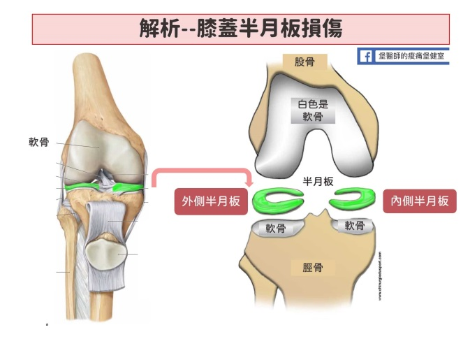
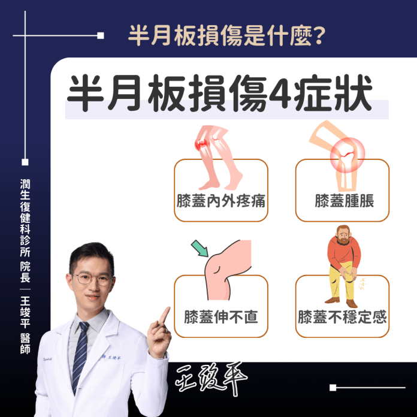

# 膝蓋半月板損傷

Q1：膝蓋半月板損傷是甚麼？

A：半月板是膝蓋內外側的軟骨，負責吸震、穩定膝關節。膝蓋半月板受傷的症狀包括疼痛、腫脹、僵硬、卡住感或軟腳，通常因膝蓋扭轉或深蹲等動作引起。
Q2：半月板損傷是怎麼發生的？
A：常因扭轉、蹲下、跳躍、運動傷害或退化逐漸磨損造成。
Q3：常見症狀有哪些？

疼痛與不適：: 膝蓋內外側疼痛，彎曲、下樓梯、負重
或扭轉時加劇。
腫脹與僵硬：: 膝蓋可能腫脹、發熱，早晨或久坐後特
別僵硬。
關節卡住：: 膝蓋在特定角度突然卡住，伸不直或無法彎曲。
不穩定感：: 感覺膝蓋軟弱、要滑出去或會突然「軟掉」。
異音：: 活動時有「喀喀」聲或異物感。
Q4：需要做 MRI 才能確診嗎？
A：會經由醫師問診、理學檢查，可能需X光（排除骨折）或核磁共振(MRI) 來確定診斷。
Q5：半月板損傷的治療?

保守治療：休息、冰敷、抬高腿、護具、物理治療。
注射治療： 高濃度葡萄糖或PRP (自體血小板生長因子) 注射，促進修復。
手術治療：關節鏡修補或部分切除，適用於嚴重、保守治療無效者。
Q6：半月板損傷可以走路嗎？
A：可以，但受限程度依撕裂嚴重度而定。
Q7：半月板損傷會卡住膝蓋嗎？
A：會，尤其是桶柄型撕裂。
Q8：半月板損傷需要開刀嗎？
A：半月板損傷不一定需要開刀，輕微撕裂有機會自行修復，但需避免加重傷勢。只有特定撕裂型態或卡住無法伸直時醫師會評估建議。
Q9：半月板損傷一定會腫嗎？
A：不一定，但急性損傷常伴隨腫脹。
Q10：年輕人比較容易完全撕裂嗎？
A：是，因常發生於運動傷害。
Q11：半月板撕裂可以自癒嗎？
A：外1/3 血液供應較佳，有機會癒合；內側多數不會自行癒合。
Q12：急性期應該冰敷嗎？
A：是，使用 RICE 原則減少腫脹。
Q13：半月板損傷和退化性關節炎有關嗎？
A：有，退化會增加撕裂風險。
Q14：複雜型撕裂是什麼？
A：多方向與多層次撕裂，常見於老年退化。
Q15：半月軟骨損傷後什麼時候該看醫生？
疼痛持續4 週以上未改善。
有明顯卡住、腫脹、不穩定感。
影響正常行走或日常生活。
有以上情形若不積極治療，可能加速關節退化，甚至演變成退化性關節炎。
Q16：要避免哪些動作？
A：深蹲、扭轉膝蓋、跳躍、上下樓。
Q17：需要帶護膝嗎？
A：戴護具有助穩定保護，特別是走路時。
Q18：半月板修補手術恢復期多久？
A：約 3–6 個月。
Q19：半月板切除手術恢復期多久？
A：約 4–8 週。
Q20：哪些運動有助改善？
A：大腿前後肌力訓練、直抬腿運動。
Q21：可以跑步嗎？
A：急性期不行，恢復期需循序漸進，建議詢問醫師評估後決定。
Q22：半月板損傷會造成膝蓋不穩嗎？
A：可能會，但不像十字韌帶損傷那麼明顯。
Q23：抽水（抽積液）有必要嗎？
A：若腫脹嚴重導致活動受限，可抽出關節積液或血水改善。
Q24：使用 PRP 對半月板有幫助嗎？
A：研究顯示使用高濃度血小板生長因子，直接注射到受傷的半月板位置。視受傷情況注射1-3次，有幫助。
Q25：震波治療對半月板有效嗎？
A：對減痛有效，但不是主要修復方式。
Q26：如何預防半月板損傷？
A：肌力訓練：可做單腿蹲、深蹲、腿推機等運動，增加大腿前後側肌力。避免扭轉動作、穿適當鞋子。
Q27：半月板損傷會引起膝蓋打軟腿嗎？
A：會，疼痛或卡住會導致瞬間失力。
Q28：半月板手術後會退化更快嗎？
A：切除半月板會稍微加速退化，因此能修補盡量修補。
Q29：半月板損傷會變嚴重嗎？
A：若持續扭轉或負重，撕裂可能加劇。
Q30：何時應該開刀？
A：膝蓋卡住無法伸直、反覆疼痛無法走路、撕裂影響關節穩定度時。
