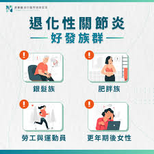
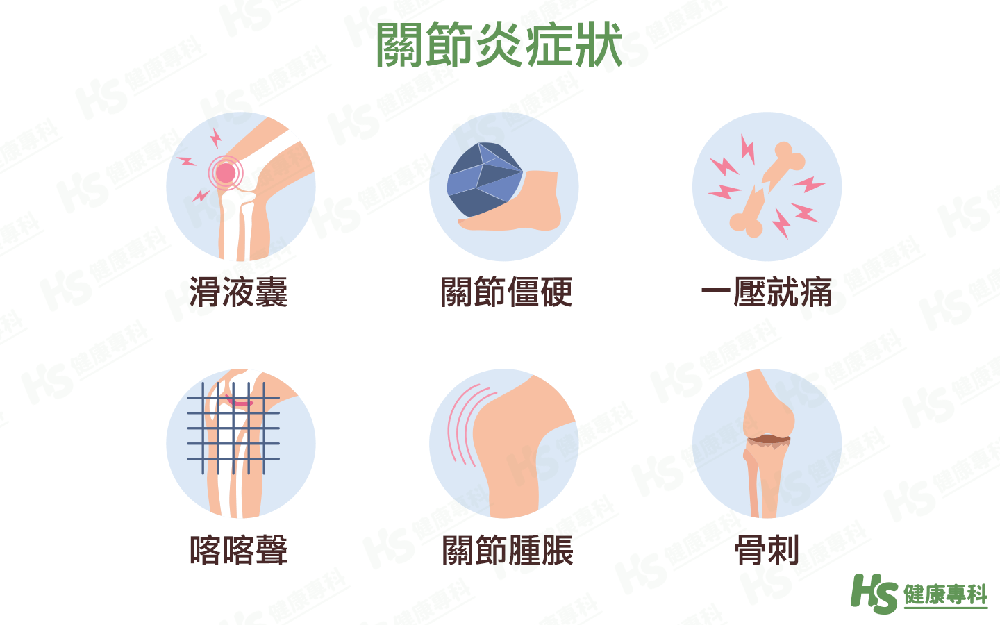
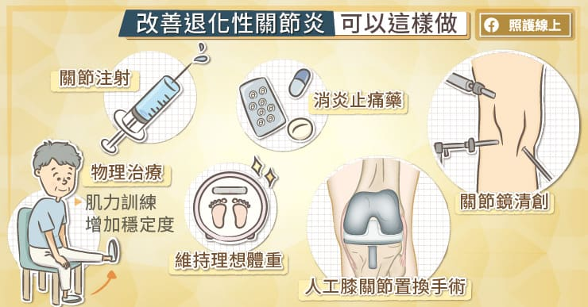

# 退化性關節炎

退化性關節炎
Q1：什麼是退化性膝關節炎？
A：當關節部位因軟骨過度使用磨損，或是滑液分泌發生異常，夾在骨頭間的軟骨逐漸失去彈性、變薄，最後完全磨損，讓骨頭與骨頭中有縫隙、缺少緩衝潤滑，進而導致骨頭之間強強摩擦，就會造成退化性關節炎。會導致疼痛、關節僵硬和活動受限的慢性疾病，
Q2：退化性關節炎的原因？
A：家族遺傳或先天性關節結構異常
年齡增長造成關節自然老化
長期反覆使用或過度負重導致關節磨損
曾有外傷、骨折或慢性發炎性疾病（如風濕性關節炎）
肌少症、肥胖、代謝異常等全身性因素
Q3：退化性膝關節炎最常發生在哪些人？

A：中老年人、膝關節過度使用者(例如常跪拜)、肥胖者、運動過度者(例如常爬山、下樓梯)、曾受膝部外傷者。
Q4：膝關節炎的主要症狀有哪些？
A：疼痛：活動時痠痛，休息後好轉，久坐或久站後加劇。
僵硬：早晨起床關節僵硬，活動後改善。

異音/摩擦感：活動時有卡卡聲或不平滑感。
腫脹：關節可能腫脹。
變形：嚴重時可能導致O型腿。
Q5：早上起床膝蓋僵硬是退化嗎？
A：可能是，通常活動後會稍微改善。
Q6：X 光可以確診退化性膝關節炎嗎？
A：可以，透過關節間隙變窄、骨刺形成等變化判斷。
Q7：為什麼會膝蓋退化？
A：自然老化、軟骨耗損、力線不正、肥胖、長期負重或過度使用造成磨損。
Q8：膝蓋退化會自己好嗎？
A：退化性關節炎目前尚無完全根治方法，但透過合適治療仍能控制症狀、減輕疼痛，維持關節功能與生活品質。醫師會依據檢查結果、症狀表現及疼痛程度，判斷退化分期，並提供對應治療建議。
Q9：膝關節炎的治療與保養方法有哪些？

A：生活習慣調整：減重、避免過度負重，適度休息。
適度運動：游泳、瑜珈、太極拳等緩和運動。
物理治療：熱敷、電療、伸展，強化股四頭肌復健運動。
藥物：消炎止痛藥（NSAIDs）、普拿疼等。
輔具：護膝、拐杖或肌內效貼布固定。
注射治療：類固醇、玻尿酸、自體血小板血漿注射PRP。
手術：人工關節置換（嚴重時）。
Q10：膝蓋退化需要開刀嗎？
A：輕中度不需要，嚴重磨損退化或變形者則考慮人工膝關節置換。
Q11：玻尿酸注射有效嗎？
A：能改善關節潤滑、減少疼痛，效果約維持 6–12 個月。
Q12：PRP 對膝蓋退化有幫助嗎？
A：提高關節組織修復能力，可減輕疼痛並改善功能，尤其對輕中度關節炎患者。
Q13：退化性關節炎的日常注意事項?
A：*維持理想體重，減輕膝關節負荷是關鍵。
*姿勢方面，盡量避免久坐、久站或長時間蹲跪。
*取物時別直接彎腰，改以彎膝下蹲，搬東西時則盡量用手臂和大關節出力，減少對
小關節的損耗。
*選擇鞋底有避震緩衝的鞋款，降低對關節的負擔，讓行走更輕鬆。
*天氣寒冷或長時間待在冷氣房時，關節容易僵硬不適，適度保暖能明顯改善。
*輔助工具如護膝、助行器等，也能幫助分散膝關節壓力。
Q14：退化性關節炎不治療會怎樣？
A：不治療可能一開始只是偶爾疼痛，但隨著時間推進，關節軟骨會越磨越薄，疼痛會愈來愈頻繁。最後可能會走路困難、變形、甚至需要輔助器材。所以，拖延只會讓日常生活更不方便，及早治療能避免惡化。
Q12：退化性膝關節炎可以運動嗎？
A：可以且建議運動，能強化肌肉減少關節壓力。
Q13：哪些運動適合膝蓋退化者？
A：適合做低衝擊的有氧運動（如游泳、騎自行車、走路），與股四頭肌訓練、伸展訓練（如靠牆微蹲、大腿伸展），能強化肌肉、減輕疼痛。關鍵是循序漸進、避免劇痛，並搭配體重控制與正確姿勢。
Q14：膝關節退化了哪些運動要避免？
A：不建議高衝擊運動（跑步、跳躍、球類）及深蹲、跪坐、爬山等動作也要減少頻繁上下樓梯，因會增加關節負擔與損傷。
Q15：膝蓋退化的疼痛為什麼上下樓梯更明顯？
A：因樓梯會增加膝蓋負重，是平地的 3–4 倍。
Q16：膝蓋會卡卡、喀喀響正常嗎？
A：輕微聲音正常，但若伴隨疼痛或異聲頻率高則建議就診醫師評估。
Q17：減重對膝蓋退化有幫助嗎？
A：非常有幫助，體重每減 1 公斤，膝蓋受力可減約 3–4 公斤。
Q18：電療、熱療對膝蓋退化有效嗎？
A：有效，可減輕疼痛、改善循環與活動度。
Q19：貼紮能改善退化性膝蓋痛嗎？
A：可改善力線與減輕壓力，對部分患者有效。
Q20：退化會讓膝蓋變形嗎？
A：會，嚴重退化者可能出現 O 型腿（內翻）或 X 型腿（外翻）。
Q21：退化性膝關節炎會影響走路速度嗎？
A：會，因為疼痛，肌力較差會使步伐變慢、距離變短。
Q22：膝蓋退化要做MRI檢查嗎？
A：多數不需要，一般只有懷疑韌帶、半月板受傷有問題時才需要。
Q23：膝蓋腫脹是退化嗎？
A：可能是滑膜發炎或積水，是退化常見現象，建議就診由醫師檢查評估。
Q24：膝蓋積水需要抽掉嗎？
A：若嚴重疼痛或活動受限可由醫師評估抽取，但仍需治療發炎根源。
Q25：吃葡萄糖胺有效嗎？
A：部分人有效，但效果因人而異，不能完全阻止退化。
Q26：退化性膝關節炎會影響睡眠嗎？
A：會，夜間疼痛會造成翻身痛與睡眠品質下降。
Q27：爬山對膝蓋退化好嗎？
A：不建議，因上下坡增加膝蓋壓力。
Q28：熱敷還是冰敷比較好？
A：慢性退化以熱敷較佳；急性腫痛時適合冰敷。
Q29：如何預防膝蓋退化惡化？
A：減重、適度運動、保持良好力線、避免過度使用。
Q30：退化性膝關節炎可以治癒嗎？
A：退化無法逆轉，但透過治療可以長期控制、降低疼痛並維持生活品質。
