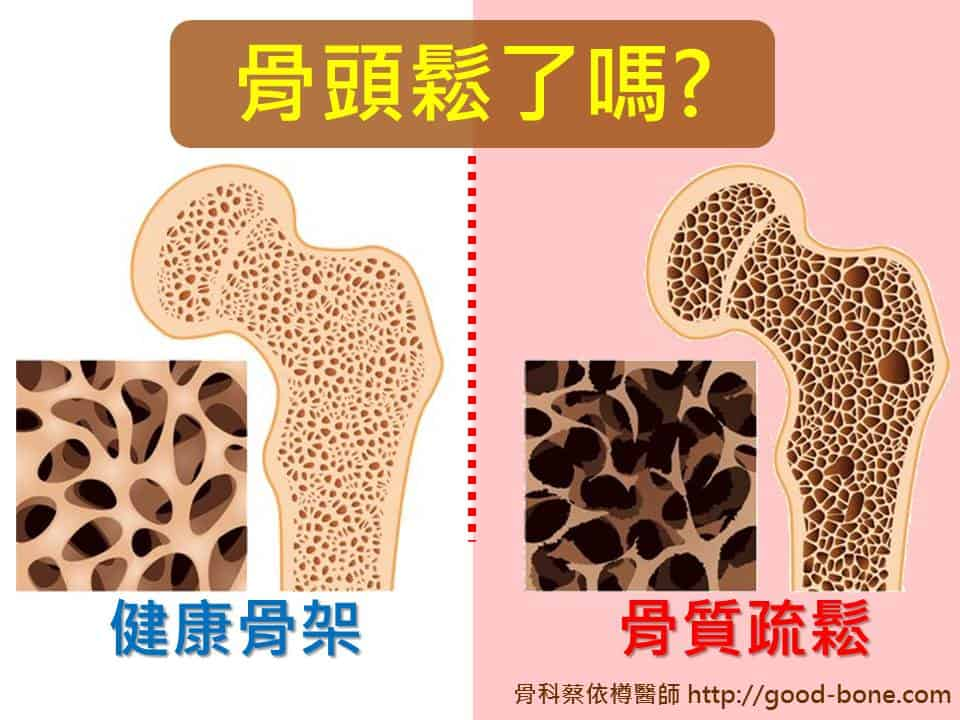
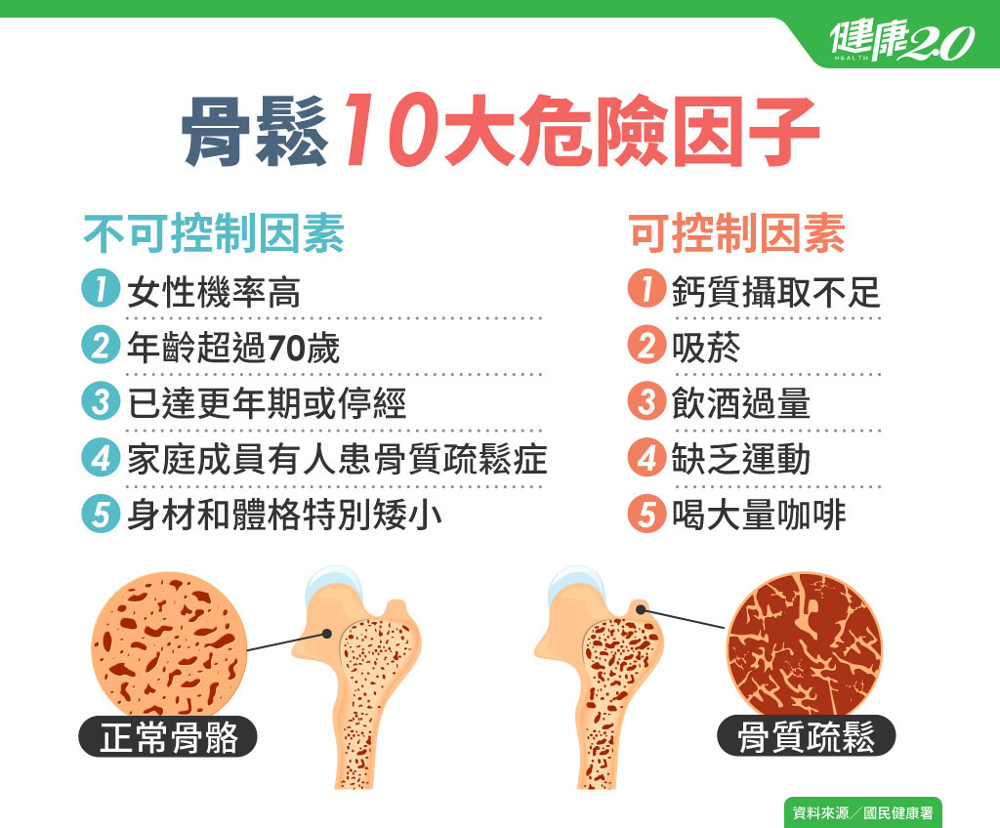

# 骨質疏鬆

Q1：什麼是骨質疏鬆？

A：骨質疏鬆（Osteoporosis）是一種骨骼疾病，
其特點是骨密度下降、骨骼結構受損，導致骨頭變得
脆弱、多孔，因而極易發生骨折。
這種疾病通常在早期沒有明顯症狀，常被稱為「沉默的疾病」，直到發生骨折（如髖骨、脊椎、手腕）才被發現。骨質流失是從30歲後開始的自然現象，但若流失過快，就會增加骨折風險，影響生活品質。
Q2：骨質疏鬆會有症狀嗎？
A：通常沒有明顯症狀，常在骨折後才被發現。

Q3：哪些人容易得骨質疏鬆？
A：*女性：尤其是停經後婦女（雌激素減少）。
*年長者：70歲以上者骨質流失加速。
*生活習慣：鈣攝取不足、缺乏運動、抽菸、過量飲酒、咖啡因。
*特定藥物：如長期使用類固醇、某些利尿劑。
*家族史：有骨鬆家族史者。
*體重過輕
Q4：骨質疏鬆最容易發生哪些骨折？
A：髖部、脊椎（壓迫性骨折）、手腕骨折最常見。
Q5：如何診斷骨質疏鬆？
A：透過骨密度檢測（DEXA）判定。
Q6：T-score 是什麼？
A：T-score 代表骨密度值，低於 -2.5 即為骨質疏鬆。
Q7：骨質疏鬆會痛嗎？
A：本身不痛，但若引起脊椎壓迫性骨折會造成背痛。
Q8：骨質疏鬆能治療嗎？
A：能，透過藥物、飲食與運動改善骨密度。
Q9：骨質疏鬆藥物有哪些？
A：雙磷酸鹽（Alendronate）、Denosumab、Raloxifene、賀爾蒙治療等。
Q10：什麼時候需要使用骨質疏鬆藥物？
A：T-score ≤ -2.5、有骨折史、或 FRAX 評估風險高者。
Q11：骨質疏鬆一定要補鈣嗎？
A：需要，但須搭配維生素 D 才能有效吸收。
Q12：每天要補充多少鈣？
A：成人每日 1000–1200 mg。
Q13：哪些食物含鈣量高？
A：牛奶、小魚乾、深綠色蔬菜、豆腐、起司。
Q14：維生素 D 為什麼重要？
A：促進鈣吸收、增強骨頭與肌力，降低跌倒風險。
Q15：如何增加維生素 D？
A：日曬 10–20 分鐘、補充維生素 D 食物或營養品。
Q16：骨質疏鬆患者適合哪些運動？
A：負重運動（走路、慢跑）、阻力訓練、平衡訓練。
Q17：哪些運動要避免？
A：高衝擊、容易跌倒、劇烈扭轉脊椎的運動。
Q18：體重過輕會增加骨折風險嗎？
A：會，BMI 過低者骨密度較低、跌倒風險較高。
Q19：抽菸與喝酒會讓骨質變差嗎？
A：會，尼古丁與酒精會抑制骨生長並加速骨流失。
Q20：骨質疏鬆造成的脊椎壓迫性骨折有哪些症狀？
A：背痛、駝背、變矮、站久或彎腰加重疼痛。
Q21：骨密度多久檢查一次？
A：一般每 1–2 年追蹤一次。
Q22：男性也會骨質疏鬆嗎？
A：會，但通常較女性晚出現。
Q23：停經與骨質疏鬆有何關係？
A：停經後雌激素下降會快速流失骨質。
Q24：骨質疏鬆與年齡有直接關係嗎？
A：有，年齡越大，骨質流失越快。
Q25：怎麼預防跌倒造成骨折？
A：改善居家照明、防滑地板、扶手、穿防滑鞋、平衡訓練等都是預防跌倒造成骨折的方法。
Q26：喝牛奶會讓骨頭變強嗎？
A：是良好鈣質來源，但需搭配維生素 D 與運動才能增加效果。
Q27：膠原蛋白能改善骨質疏鬆嗎？
A：無法直接增加骨密度，但可能有助關節健康。
Q28：長期吃類固醇會增加骨質疏鬆嗎？
A：會，是造成繼發性骨質疏鬆的重要原因。
Q29：骨質疏鬆會影響身高嗎？
A：會，脊椎壓迫性骨折會使身高變矮。
Q30：如何預防骨質疏鬆？
A：透過均衡飲食充足的鈣質和維生素D攝取、規律運動（負重運動）、戒菸戒酒、避免長期臥床，並在醫生指導下進行治療，以減緩骨質流失。
