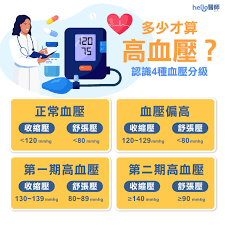
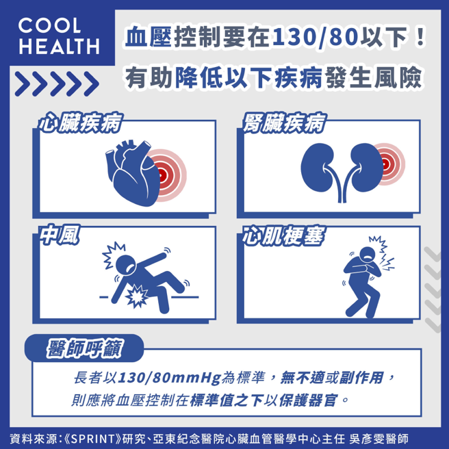
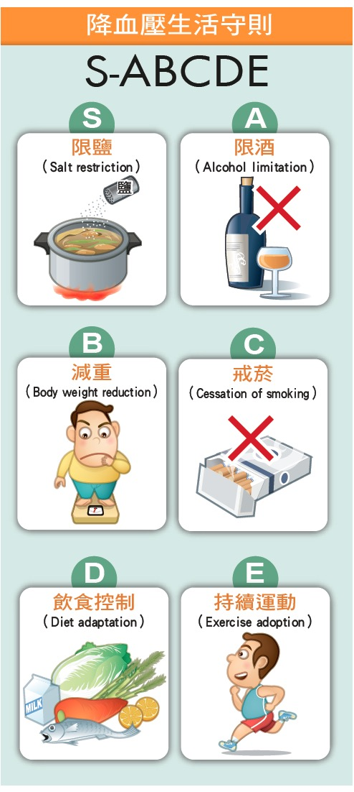

# 高血壓

Q1：什麼是高血壓？
A：血壓就是血液由心臟送出時對動脈血管壁的側壓力。想像：馬達、水、水管，身體的心臟像是一個水廠馬達，血管就像自來水管，當心臟打出血液打入動脈時的壓力，就產生收縮壓，心臟舒張時，血液回流的壓力，稱之為舒張壓。高血壓是血管內壓力長期過高，收縮壓 ≥130 mmHg 或舒張壓 ≥80 mmHg 即為高血壓。

Q2：高血壓會有症狀嗎？
A：高血壓也許毫無症狀。偶爾會感覺頭痛，後頸部緊緊的，當血壓非常高時，很可能造成眼、腦、心、腎、大血管的損害而引起以下症狀：視力模糊、嚴重頭痛、耳鳴、神智不清、肢體無力或麻木、噁心、嘔吐、大量出汗、胸痛、呼吸困難...等。
多數人無症狀，因此被稱為「隱形殺手」。
Q3：高血壓如何診斷？
A：需多次量測血壓確認，於不同時間、不同環境都偏高才確診。
Q4：高血壓的原因？
A：95％以上的高血壓是罹患原因不明的原發性高血壓，可能與遺傳、環境、飲食、菸酒有關。另有小於5％高血壓是患有內分泌、腎病或血管疾病等引起的續發性高血壓。
Q5：高血壓的危險因素有哪些？
A：一般因素：肥胖、家族史、高鹽高油飲食、抽菸、飲酒、缺乏運動、壓力大。
疾病因素：糖尿病、腎臟病或內分泌、血管疾病。
Q6：未控制的高血壓有什麼風險？

A：未控制的高血壓常被稱為「沉默的殺手」，長期忽
視會嚴重損害全身血管與器官，主要風險包括：
中風、心肌梗塞、心衰竭、腎臟病、視網膜病變
增加罹患失智症（如血管性失智）與記憶力退化的險。
Q7：高血壓可以治癒嗎？
A：無法根治，但可透過藥物與生活方式調整。
Q8：高血壓患者需要吃藥嗎？
A：由醫師檢查評估，中高度血壓通常需要服藥治療，避免惡化或產生併發症。輕度高血壓者可先嘗試改善生活習慣，進而調整血壓。
Q9：高血壓藥可以停藥嗎？
A：不可自行停藥，停藥可能會導致血壓反彈甚至中風。
Q10：喝咖啡會升高血壓嗎？
A：部分人反應較敏感，咖啡因可能短暫升高血壓。
Q11：量血壓的最佳時間是什麼時候？
A：早上起床後與晚上睡前各量一次，記錄變化最準確。
Q12：量血壓要注意什麼事項?
A：-測量前必須坐下或躺下休息五分鐘。
-手臂有支撐放在與心臟同高之位置
-量血壓前三十分不要抽煙或攝取含咖啡因飲料
-選用適當大小之血壓加壓帶
Q13：高血壓的居家注意事項？

A:
戒菸：可減低發生心臟病及腦中風之機率。
減重：維持理想體重，減低體重過重所增加
之心臟負荷。
低鹽飲食：減少鈉鹽的攝取，可使血壓下降，
飲食宜採清淡，盡量避免食用醃漬食物。
控制飲酒：
男性每天酒精攝取量應小於30公克/天
女性每天酒精攝取量應小於20公克/天
規律的運動習慣：
規律的運動：每週至少3～4次，每次30分鐘，做一些安全溫和的有氧運動，例如快走、慢跑、游泳、騎腳踏車…等。
對於有慢性併發症及血壓控制不良的病友，選擇運動種類前應先由醫師
做完整的評估，依生理情況選擇合適的運動種類。
正確使用降血壓藥物：
養成正確用藥習慣，若改善了生活習慣，還是無法控制血壓，則要進一步尋求藥物的治療。藥物種類繁多，絕不可病急亂吃藥，須經醫師診斷後再服藥。
均衡飲食：
少吃飽和脂肪與膽固醇的食物，如動物性肉類（魚類除外），內臟如豬腦、心、肝、腰子等，應減量並減少攝取頻率。
多攝取高纖食品，如青菜、水果、全麥製品。飲食須定時定量，多用水
煮、蒸、烤等烹調方式，減少油脂攝取。少暍濃茶、咖啡等刺激性飲料。
日常保健：定期測量及記錄血壓。注意保暖，冷天避免外出。保持心情愉快，充分休息與睡眠，攝取足量水分。
Q14：高血壓患者應避免哪些食物？
A：高鹽食物、泡麵、加工食品、醃漬品、含糖飲料。
Q15：鹽分攝取應控制多少？
A：低鹽飲食：＜6公克/天。( 5公克食鹽約 = 1茶匙食鹽 = 6茶匙醬油 )。
Q16：高血壓與肥胖有關嗎？
A：密切相關，體重增加會讓血壓升高。
Q17：運動對高血壓有幫助嗎？
A：有，每週 150 分鐘中等強度運動可降低血壓。
Q18：壓力會導致高血壓嗎？
A：會，壓力使交感神經活性上升，導致血壓升高。
Q19：高血壓患者可以喝酒嗎？
A：不建議，酒精會使血壓上升。
若要飲用，則應注意攝取量:
男性每天酒精攝取量應小於30公克(不超過30毫克，約等於啤酒600ml、紅酒240ml
或威士忌75ml)
女性每天酒精攝取量應小於20公克
Q20：抽菸與高血壓有什麼關係？
A：尼古丁會使血管收縮導致血壓上升，是心血管風險因子。
Q21：高血壓藥有哪些種類？
A：高血壓藥物主要有六大類，包括利尿劑、鈣離子阻斷劑、血管張力素轉換酶抑制劑
(ACEI)、血管張力素受體阻斷劑(ARB)、乙型阻斷劑、甲型阻斷劑等，它們透過不同
機制（如排鈉水分、擴張血管、抑制血管收縮）來降血壓，常會合併使用以達最佳
效果，並需遵醫囑用藥。
Q22：血壓高會頭痛嗎？
A：可能會，但多數高血壓患者無明顯症狀。
Q23：血壓多少算控制良好？
A：大多數成人目標為 <130/80 mmHg（依醫師指示調整）。
Q24：降血壓藥會造成頭暈嗎？
A：基本上不會，但若有頭暈、虛弱情形，建議先休息量測血壓，並回診給醫師評估檢查，視情況調整藥物或劑量。
Q25：高血壓患者可以運動重訓嗎？
A：可，但應循序漸進，避免閉氣用力或太過激烈運動（會使血壓上升）。
Q26：高血壓需要多久回診一次？
A：聽從醫師建議，初期治療或控制不穩定者，可能每周或每2周回診評估調整藥物。控制穩定者每1- 3 個月追蹤一次。
Q27：晚上血壓比較高正常嗎？
A：大部分人夜間血壓會下降，若反而升高，建議紀錄每次血壓數值，回診時提供醫師評估。
Q28：血壓突然升高怎麼辦？
A：先休息放鬆，10–15 分鐘後再量，若持續 ≥180/100 且伴隨不適需立即就醫。
Q29：高血壓會影響腎臟嗎？
A：會，長期高血壓會損傷腎小球，甚至引發腎衰竭。
Q30：血壓過低也會有問題嗎？
A：會，易造成暈眩、跌倒、供血不足等問題。
Q31：吃太鹹真的會得高血壓嗎？
A：會，高鈉飲食是高血壓主因之一。
建議鹽分攝取每天＜6公克 。( 5公克食鹽約 = 1茶匙食鹽 = 6茶匙醬油 )。
泡麵、加工食品、醃漬品、蜜餞都屬於高鈉食物，要減少食用。
Q32：如何預防高血壓？
A：-戒菸：可減低發生心臟病及腦中風之機率。
-減重：維持理想體重，減低體重過重所增加之心臟負荷。
-低鹽飲食：減少鈉鹽的攝取，可使血壓下降，飲食宜採清淡，盡量避免食用醃漬
食物。
-控制飲酒：
男性每天酒精攝取量應小於30公克/天
女性每天酒精攝取量應小於20公克/天
-規律的運動習慣：
規律的運動：每週至少3～4次，每次30分鐘，做一些安全溫和的有氧運動，例
如快走、慢跑、游泳、騎腳踏車…等。
-均衡飲食：
少吃飽和脂肪與膽固醇的食物，如動物性肉類（魚類除外），內臟如豬腦、心、
肝、腰子等，應減量並減少攝取頻率。
多攝取高纖食品，如青菜、水果、全麥製品。飲食須定時定量，多用水煮、蒸、
烤等烹調方式，減少油脂攝取。少暍濃茶、咖啡等刺激性飲料。
-日常保健：定期測量及記錄血壓。保持心情愉快，充分休息與睡眠，攝取足量水
分。
