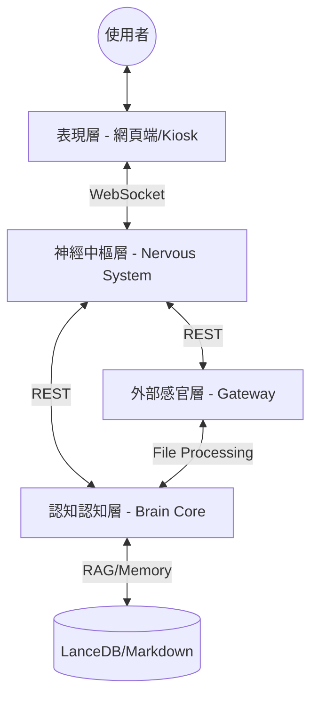

# 00_SYSTEM_ARCHITECTURE.md
## openVman 系統總體架構概覽 (General Architecture Overview)

### 1. 核心設計哲學：神經與認知解耦
openVman 採用三層（邏輯上為四層）解耦架構，將「低延遲的反射動作（神經系統）」與「深度思考的邏輯處理（認知核心）」完全分離。

### 2. 四大組件定義 (The 4 Pillars)

#### 2.1 表現層 (Frontend / Sensory Layer)
* **角色**：感官器官。
* **職責**：採集語音 (ASR)、執行低延遲 AI 對嘴渲染 (DINet/Wav2Lip)、維護 UI 狀態。
* **路徑**：`frontend/app/`

#### 2.2 神經中樞層 (Backend / Nervous System)
* **角色**：發聲器官與排程中心。
* **職責**：管理 WebSocket Session、文字切分 (Chunking)、語音合成 (TTS)、中斷判定 (Guard Agent)。
* **路徑**：`backend/app/`

#### 2.3 認知認知層 (Brain / Cognitive Core)
* **角色**：靈魂與記憶。
* **職責**：LLM 人格推理、RAG 向量檢索 (LanceDB)、技能工具調用 (Skills)。
* **路徑**：`brain/api/`

#### 2.4 外部感官層 (Gateway / External Sensory Layer)
* **角色**：外部連結器。
* **職責**：文件預處理 (MarkItDown)、視覺分析插件、非同步腳本執行。
* **路徑**：`backend/app/gateway/`

---

### 3. 高層級資料流 (High-Level Data Flow)



### 4. 關鍵工作流 (ASCII Architecture)

為了在終端或簡易編輯器中也能快速理解架構，以下提供 ASCII 版本：

```text
+-----------------------+       WebSocket        +------------------------+
|   表现层 (Frontend)    | <-------------------> |   神經中樞層 (Backend)   |
|   (Sensory Layer)     |                       |   (Nervous System)     |
+-----------+-----------+                       +-----------+------------+
            ^                                               |
            | HTTP (Upload)                                 | REST (POST)
            v                                               v
+-----------+-----------+       File System       +-----------+------------+
|   外部感官 (Gateway)   | ---------------------> |   大腦認知 (Brain Core) |
|  (External Sensory)   |                       |   (Cognitive Logic)    |
+-----------------------+                       +-----------+------------+
                                                            |
                                                            v
                                                  +---------+----------+
                                                  | 記憶與知識 (Memory) |
                                                  | (LanceDB / MD)     |
                                                  +--------------------+
```

### 5. 關鍵工作流

1. **對話流**：Frontend ASR -> Backend -> Brain (Stream Token) -> Backend (TTS Chunk) -> Frontend -> AI 對嘴播放。
2. **知識庫流**：Admin 上傳檔案 -> Gateway (MarkItDown) -> Backend -> 存入工作區並通知 Brain 重新索引。

### 5. 後續擴充
開發者應優先在 `docs/` 下查看具體組件的詳細規格書：
- `01_BACKEND_SPEC.md`
- `02_FRONTEND_SPEC.md`
- `03_BRAIN_SPEC.md`
- `09_API_WS_LINKAGE.md`
