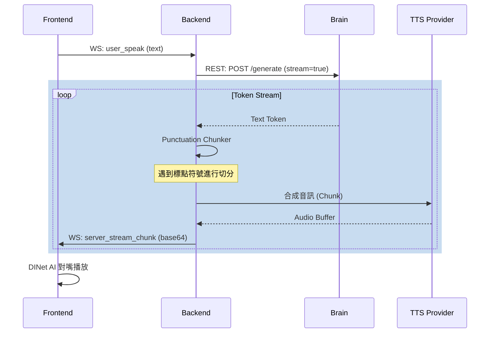
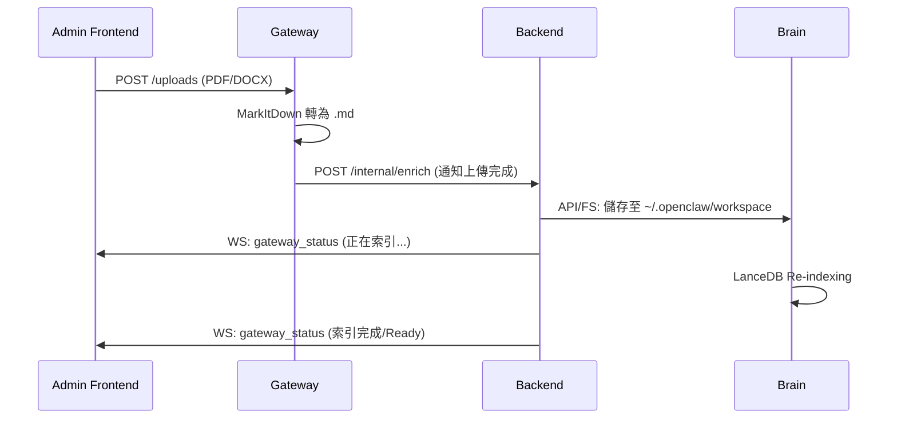

# 09_API_WS_LINKAGE.md
## 組件通訊與聯動規格 (API & WS Linkage Spec)

本文定義 openVman 各組件間的溝通邊界與時序邏輯。

### 1. 通訊地圖 (Communication Map)

| 源端 (From) | 目的端 (To) | 類型 | 說明 |
| :--- | :--- | :--- | :--- |
| Frontend | Backend | WebSocket | 即時語句、中斷指令、音訊接收 |
| Frontend | Gateway | REST (POST) | 文件/媒體檔案上傳 |
| Backend | Brain | REST (POST) | 請求 LLM 生成回應文字串流 |
| Backend | Gateway | REST (POST) | 通知 Gateway 執行特定增強任務 |
| Gateway | Backend | REST (POST) | 回報非同步任務完成 (Enrichment) |
| Gateway | Brain | FS/API | 將處理好的 Markdown 文件寫入 Brain 工作區 |

---

### 2. 關鍵時序圖 (Sequence Diagrams)

#### 2.1 即時對話流 (Conversational Flow)
展示從語音輸入到 AI 回應的完整閉環。

#### 2.2 知識庫上傳與索引流 (KB Ingestion Flow)
展示檔案如何轉化為 AI 可讀的知識。

### 3. 事件列表 (Events Summary)
詳見 `00_CORE_PROTOCOL.md` 與各組件規格書。
