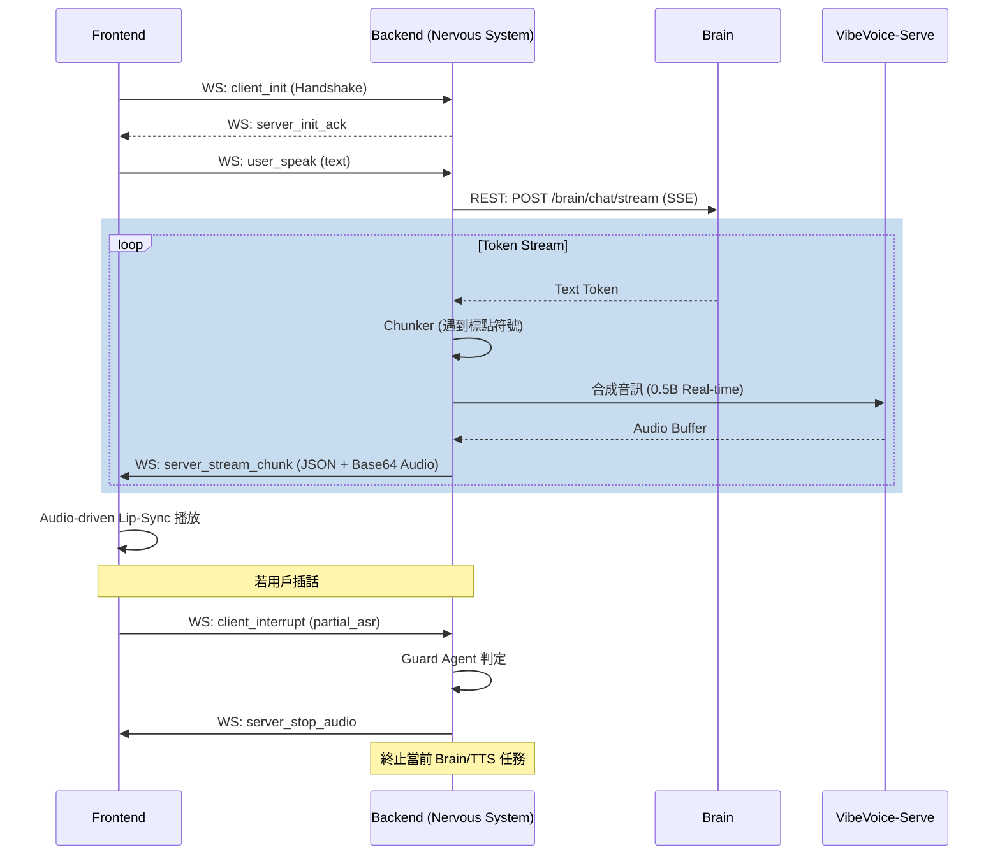
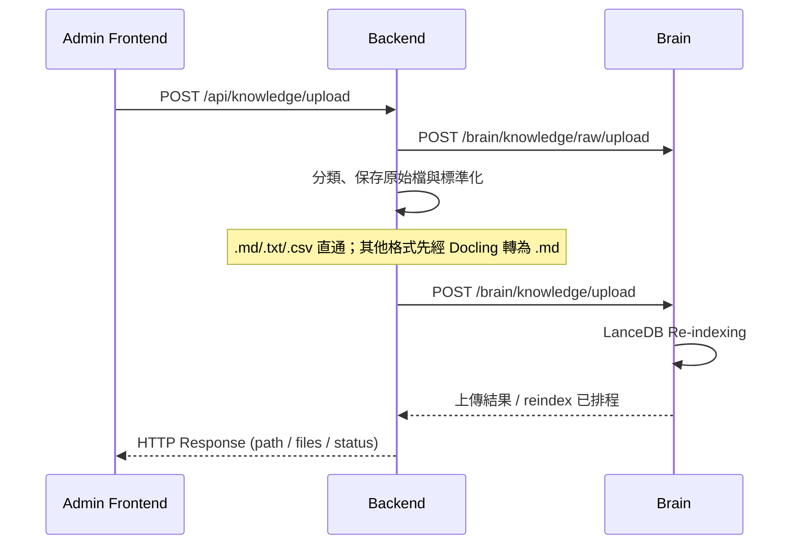

# 09_API_WS_LINKAGE.md
## 組件通訊與聯動規格 (API & WS Linkage Spec)

本文定義 openVman 各組件間的溝通邊界與時序邏輯。

### 1. 通訊地圖 (Communication Map)

| 源端 (From) | 目的端 (To) | 類型 | 說明 |
| :--- | :--- | :--- | :--- |
| Frontend | Backend | WebSocket | 即時語句、中斷指令、音訊接收 |
| Frontend | Backend (Gateway Routes) | REST (POST) | 文件/媒體檔案上傳 |
| Backend | Brain | REST (POST) | 請求 LLM 生成回應文字串流 |
| Backend (Gateway Worker) | Backend (/internal/enrich) | REST (POST) | 將媒體處理結果作為 enriched context 寫入指定 Session |
| Backend (/internal/enrich) | Brain (/internal/enrich) | REST (POST) | 驗證 internal token 後轉發 enriched context |
| Backend (Knowledge Upload Route) | Brain (/brain/knowledge/upload) | REST (POST) | 將標準化後的知識文件寫入 Brain 工作區並觸發背景索引 |

---

### 2. 關鍵時序圖 (Sequence Diagrams)

#### 2.1 即時對話流 (Conversational Flow)
展示即時語音閉環。Backend 透過 `LiveVoicePipeline` 協調 Brain SSE 串流與 VibeVoice TTS。

### 3. WebSocket 事件清單 (Live Voice Events)

| 事件名稱 | 方向 | 說明 | 關鍵欄位 |
| :--- | :--- | :--- | :--- |
| `client_init` | C -> S | 交握請求 | `client_id`, `auth_token` |
| `server_init_ack` | S -> C | 交握確認 | `session_id`, `server_version` |
| `user_speak` | C -> S | 正式語音輸入 | `text` |
| `client_interrupt` | C -> S | 插話/中斷信號 | `partial_asr` |
| `set_lip_sync_mode` | C -> S | 設置對嘴模式 | `mode` (dinet/wav2lip/webgl) |
| `server_stream_chunk`| S -> C | 回傳音訊塊 | `audio_base64`, `text`, `is_final` |
| `server_stop_audio` | S -> C | 指令：停止播放 | `reason`, `timestamp` |
| `ping` / `pong` | Both | 心跳包 | `timestamp` |

### 3. 事件列表 (Events Summary)
詳見 `00_CORE_PROTOCOL.md` 與各組件規格書。
