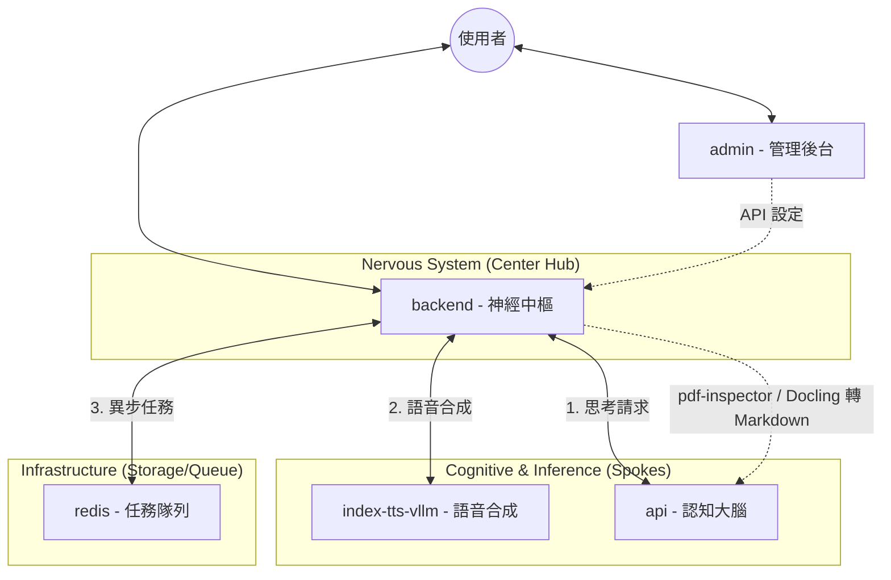

# 10_MICROSERVICES_GUIDE.md

## openVman 微服務架構與佈署指南

本文件定義了 openVman 的全服務化解耦架構。系統由多個獨立容器組成，透過內部網路（Docker Network）通訊，以達到資源隔離與高可用性。

### 1. 邏輯架構圖 (Hub & Spoke Architecture)

在 openVman 中，`backend` 是系統的「神經中樞」，負責調度所有 AI 推理服務與基礎設施。



---

### 2. 實體部署架構 (Service Topology)

這張圖展示了 `backend` 作為中心調度員的核心地位，以及它與周邊專業服務的連接關係：

```text
┌──────────────────────────────────────────────────────────────────────────┐
│                          Host / Workstation                              │
│                                                                          │
│      [ AI 專業服務商 ]             [ 神經中樞 ]             [ 基礎設施 ]      │
│     ┌──────────────┐           ┌────────────┐           ┌────────────┐   │
│     │ index-tts    │           │  backend   │           │   redis    │   │
│     │   -vllm      │◀─────────▶│ (FastAPI)  │◀─────────▶│ (Queue/DB) │   │
│     │  (GPU 0)     │           │ (Reflexes) │           │   (RAM)    │   │
│     └──────────────┘           └────────────┘           └────────────┘   │
│            ▲                          │                        ▲         │
│            │           ┌──────────────┴──────────────┐         │         │
│            │           ▼                             ▼         │         │
│            │   ┌────────────┐                 ┌────────────┐   │         │
│            │   │    api     │                 │   admin    │   │         │
│            │   │(Brain Core)│                 │ (Frontend) │   │         │
│            │   │  (GPU 1)   │                 │   (CPU)    │   │         │
│            │   └────────────┘                 └────────────┘   │         │
│                                                                        │
└──────────────────────────────────────────────────────────────────────────┘
```

---

### 3. 服務清單 (Service Inventory)

| 服務名稱 | 職責 | 主要技術 | 資源建議 |
| :--- | :--- | :--- | :--- |
| **`backend`** | **神經中樞 (Center)** | FastAPI (Python) | 輕量 (CPU) |
| **`api`** | 認知大腦 (Brain) | FastAPI, LanceDB | 中量 (CPU/GPU) |
| **`index-tts-vllm`** | 語音合成引擎 (TTS) | IndexTTS on vLLM | **重型 (GPU)** |
| **`admin`** | 管理後台前端 | React, Nginx | 輕量 (CPU) |
| **`redis`** | 任務隊列與暫存 | Redis 7 | 輕量 (RAM) |

文件解析不是獨立 compose service。PDF 上傳時由 `backend` container 內的 `pdf-inspector` 先判斷是否可走 text-based fast path；不適合 fast path 的 PDF，以及 DOCX / PPTX / XLSX，會交由 Python Docling 套件 in-process 轉成 Markdown，失敗時依設定 fallback 到 MarkItDown。

---

### 4. 服務間通訊模式

1.  **請求/響應 (Request/Response)**：`backend` 向 `api` 或 `index-tts-vllm` 發起同步請求。
2.  **串流 (Streaming)**：`api` -> `backend` -> `index-tts-vllm` 的 Token-to-Audio 流式處理。
3.  **非同步任務 (Async Tasks)**：`backend` 將繁重任務（如多模態預處理）丟進 `redis` 隊列。

---

### 5. 故障處理與降級 (Graceful Degradation)

服務化架構允許系統在部分模塊失效時繼續運作：

*   **TTS 引擎失效**：`backend` 會捕捉錯誤，自動降級至 `Edge-TTS` (雲端) 確保虛擬人仍能發聲。
*   **大腦失效**：虛擬人會進入「待機/離線」狀態，Frontend 顯示通訊異常。
