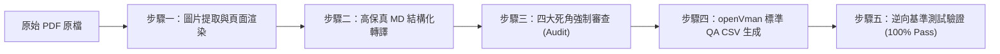

# 工業型錄 PDF 轉換高覆蓋 QA 知識庫標準作業程序 (SOP)

> **適用情境**：當取得一份全新之工業設備、泵浦或硬體型錄 PDF，需將其完整無損地轉化為 openVman Knowledge RAG 系統之標準問答集（QA CSV）與知識手冊時，必須嚴格依循本程序執行。

---

## 核心設計理念：拒絕「摘要式直出」，堅持「中間層審查」

直接由大模型（LLM）「閱讀 PDF ➡️ 直接產生 QA」時，必然會受限於注意力偏角，習慣性抓取大標題與主圖表，而遺漏頁底小字、括號限定與非線性異常數值。
**標準流水線必須透過五個階段循序解耦：**



---

## 步驟一：圖片提取與全頁渲染 (Asset Extraction & Curation)

使用 `PyMuPDF (fitz)` 工具，同步執行兩項工作，並**必須進行圖片清洗（過濾無用廢圖）**：

### 1. 內嵌原圖清洗與提取（嚴禁全量盲抽）
PDF 排版引擎內常包含大量毫無語意價值的碎屑圖片，盲抽會造成高達 70% 的垃圾圖污染 RAG 檢索。**必須設置嚴格過濾規則**：
- **尺寸門檻過濾**：寬度或高度小於 **150 px**（如表格微縮圖、圖標、Bullet 符號、箭頭）一律剔除。
- **長寬比異常過濾**：長寬比大於 5:1 或小於 1:5 的長條切片（排版裝飾色塊、漸層底條、邊框線）一律剔除。
- **檔案體積過濾**：小於 10 KB 的微小點陣圖或透明遮罩（Alpha Mask）一律剔除。
- **保留標的（真正有用的只有兩類）**：
  1. 各系列**產品外觀去背照 / 實體照**。
  2. 關鍵**內部零件特寫（如高鉻鋼葉輪、機械軸封、絞碎切刀、攪拌器）**。
- 建議賦予語意化命名（如 `hippo_2inch_pump.jpeg`，而非隨機 hash）。

### 2. 全頁高解析渲染 (150 ~ 200 DPI)
- **核心價值**：工業型錄中的 **Q-H 性能曲線圖** 與 **外型尺寸配管圖** 均由向量線條與文字疊合構成，拆圖會支離破碎。因此**整頁渲染才是最完整、最不會斷章取義的工程圖表呈現方式**。
- 命名規則：`page_{頁碼:02d}.png`，存入 `data/{catalog_name}/pages/`。

---

## 步驟二：高保真 Markdown 結構化轉譯 (PDF ➡️ MD)

在產出 QA 之前，**必須先建立一份 1:1 的 Markdown 單一事實來源（Single Source of Truth）**：

1. **章節按頁次編排**：以 `## 第 X 頁：...` 清晰分段。
2. **全量數據表無損轉表**：
   - 所有的 Data Chart 必須以 GFM Markdown 表格還原，包含每一欄（馬力、出水口徑、額定點、極限點、通過粒徑、單三相電流 FLA、淨重）。
3. **零組件清單與限定條件**：
   - 結構剖面圖（Section View）的零組件清單須完整列出，特別保留括號限定（如 `(2HP Only)`、`(24~30HP Only)`）。
4. **外觀尺寸表（Dimensions）**：
   - A, B, C, D, H 數值及最低連續運轉水位（L.W.L.）必須完整建表。

---

## 步驟三：四大死角強制審查 (The 4-Deadzone Audit)

在進入 QA 生成前，必須執行 Python 腳本針對原始文字進行正則掃描，清查以下四大死角：

| 死角分類 | 檢驗目標 | 實例（以 EVAK 型錄為例） |
| :--- | :--- | :--- |
| **1. 頁底微小註腳** | 搜尋所有 `»`、`*`、`Note`、`identify`、`optional` | `» C/L`（節能/大流量代碼）、`» (CH)`（客製高鉻閉式葉輪/球鐵吸水盤/410軸心）、`» (Q)`、`EB50H` 彎管、`» Note 2`（自動型僅限單相 0.5~3HP） |
| **2. 零件括號限定** | 搜尋所有 `Only`、`available` | `10. Lip Seal (2HP Only)`、`6. Lip Seal (24~30HP Only)`、`24. Wearing Plate (30HP Only)`、`3HP 僅限 3" DIN PN10/16` |
| **3. 表格反常數值** | 檢查非線性遞增、反常遞減之數值 | STEEL 通過粒徑：2~7.5HP 為 45mm，10HP 為 34mm，**15HP 頂配反常縮小為 25mm** |
| **4. 單位與標尺陷阱** | 檢查硬度單位、極數轉速 | ALLIGATOR 為 **55-60 HRC**（2極 2850rpm）；LEOPARD 為 **89 HRA** 鎢鋼切刃（4極 1450rpm） |

---

## 步驟四：生成 openVman 標準 QA CSV

使用 openVman 核心套件 [`brain.api.knowledge.qa_csv`](../../brain/api/knowledge/qa_csv.py) 進行序列化與驗證。

### 1. CSV 欄位規範
```csv
index,q,a,img,url,display
```
- `index`：題目序號（1, 2, 3...）
- `q`：問題標題
- `a`：解答內文（包含直接標準答案 + 【工程要點說明】+ 頁碼出處）
- `img`：關聯頁面或原圖檔名（如 `page_04.png`）
- `url`：型錄來源 URL
- `display`：`true`（預設前台顯示）

### 2. 驗證代碼
```python
from knowledge.qa_csv import serialize_qa_csv, is_qa_csv, parse_qa_csv

csv_content = serialize_qa_csv(qa_entries)
assert is_qa_csv(csv_content.encode("utf-8")), "CSV 格式不符合 openVman 規範！"
parsed = parse_qa_csv(csv_content.encode("utf-8"))
print(f"驗證通過：共成功解析 {len(parsed)} 組問答對。")
```

---

## 步驟五：逆向基準測試驗證 (Benchmark Verification)

1. 建立或載入專用測試集（如 `pump_catalog_qa_test.csv`）。
2. 撰寫自動化驗證腳本，逐題檢查標準答案的關鍵字（Keywords）、數值（Values）與專有單位（Units）是否均存在於生成的 Markdown 或 QA 題庫中。
3. **通過標準**：必須達到 **100%（例如 50/50 題全數 Pass）**，方可交付或匯入 RAG 知識庫。

---

## 版控（Git）維護準則

型錄轉換過程中所產生的下列檔案，**一律嚴禁納入 Git 版本控制**，避免倉儲體積暴增：
- `*.pdf`（大型 PDF 原件）
- `data/{catalog_name}/`（含數十 MB 之渲染頁面與提取圖片）
- `*_test.csv`（測試考題集）

請確保 `.gitignore` 已配置以下規則：
```gitignore
# Catalog extraction assets & tests
data/evak_catalog/
*.pdf
pump_catalog_qa_test.csv
```

## 本機工作檔

本次型錄的根目錄 PDF、`pump_catalog_qa_test.csv` 與 `data/evak_catalog/` 保留在本機，已用指定路徑加入 `.gitignore`。其他 PDF／CSV 不會一律被忽略；正式交付資料另行確認後再納入版本控制。
