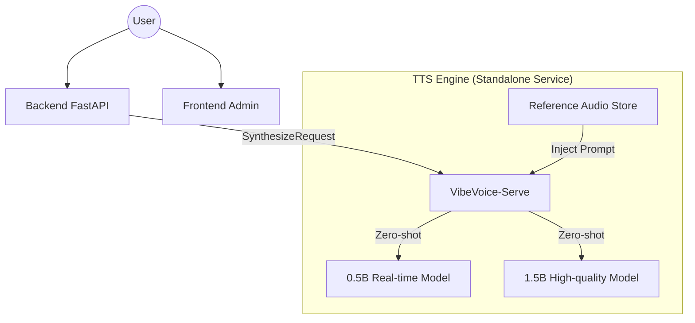

# Design: VibeVoice Integration & Architecture Decoupling

## 1. Service Architecture

The system will transition to a distributed microservice pattern.



## 2. Technical Details

### VibeVoice Adapter
A new `VibeVoiceAdapter` will be implemented, replacing `IndexTTSAdapter`.

**Key Request Payload**:
```json
{
  "text": "妳好，我是妳的虛擬助理。",
  "model": "0.5b", // or "1.5b"
  "reference_id": "taiwanese_female_friendly",
  "streaming": true
}
```

### Reference Voice Management
- **Directory**: `backend/app/assets/tts_references/*.wav`
- **Default Reference**: A high-quality clip of a female Taiwanese voice actor.
- **Mechanism**: The adapter will read the binary reference audio and send it along with the synthesis request (or a reference to it if cached by the server).

### Resource Management
- **Decoupling**: The `backend` container will no longer use `nvidia-container-toolkit` if the TTS is offloaded to another machine, or it will share the GPU via Docker Compose profiles.
- **Memory**: 0.5B model takes ~4GB; 1.5B takes ~8GB.

## 3. Fallback Strategy
1. **VibeVoice-0.5B**: Primary choice for interactive dialogue.
2. **VibeVoice-1.5B**: Fallback if 0.5B is unavailable OR explicit high-quality request.
3. **Edge-TTS**: Final fallback if local GPU services are down or overloaded.

## 4. Environment Variables
- `TTS_VIBEVOICE_URL`: URL of the standalone VibeVoice-serve.
- `TTS_VIBEVOICE_DEFAULT_MODEL`: Defaulting to "0.5b".
- `TTS_VIBEVOICE_REF_VOICE`: Filename of the default Taiwanese reference prompt.
